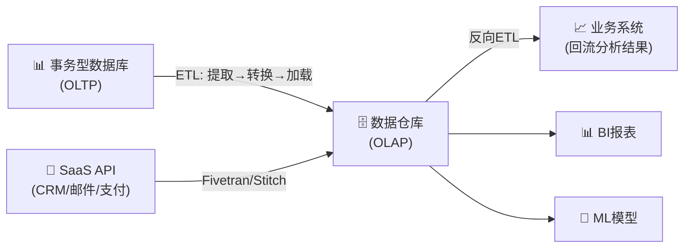
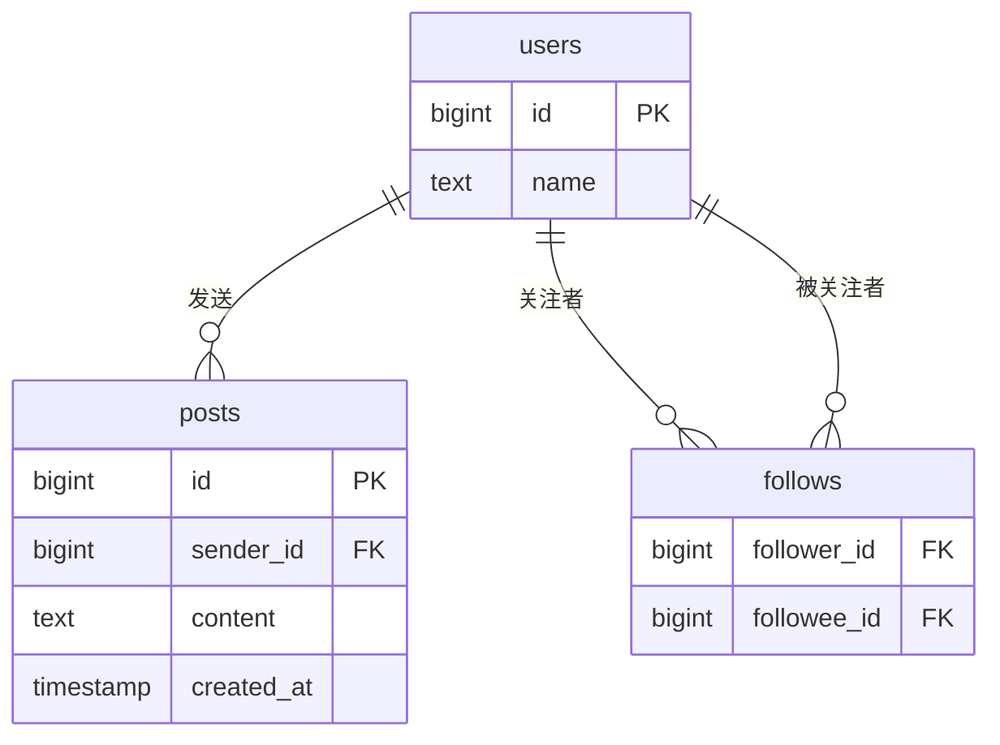
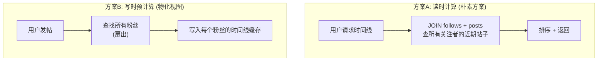
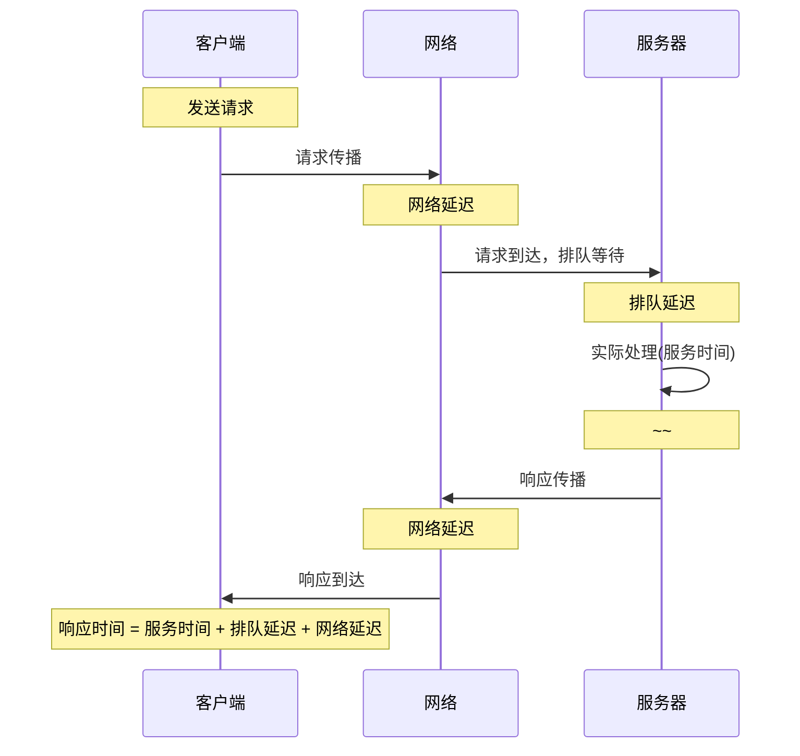
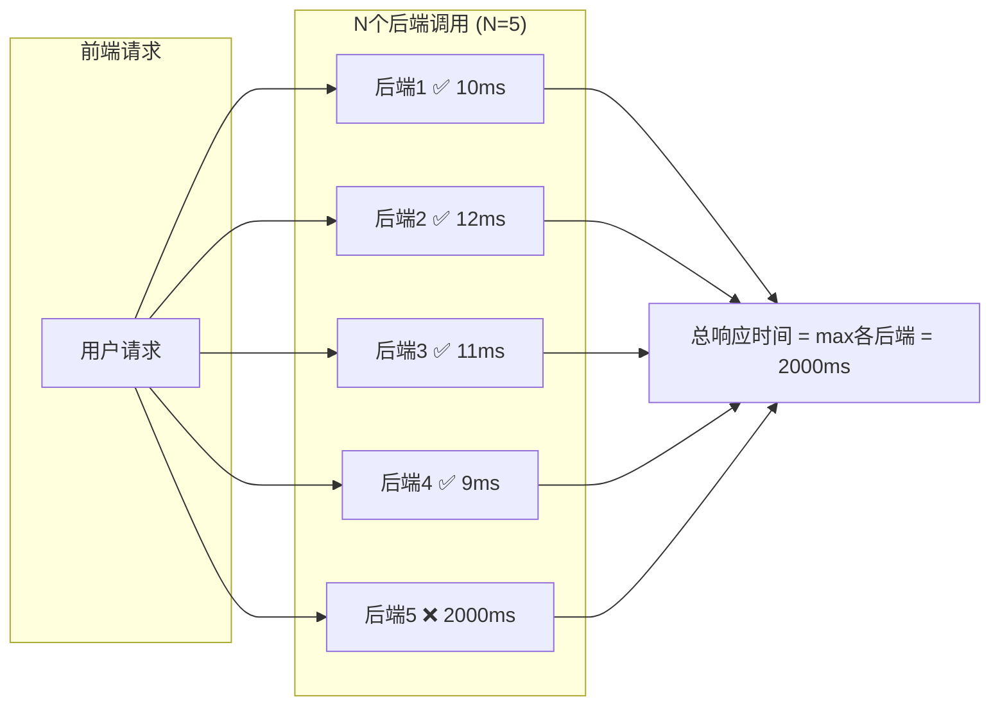
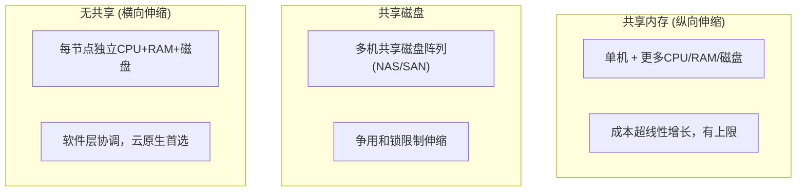
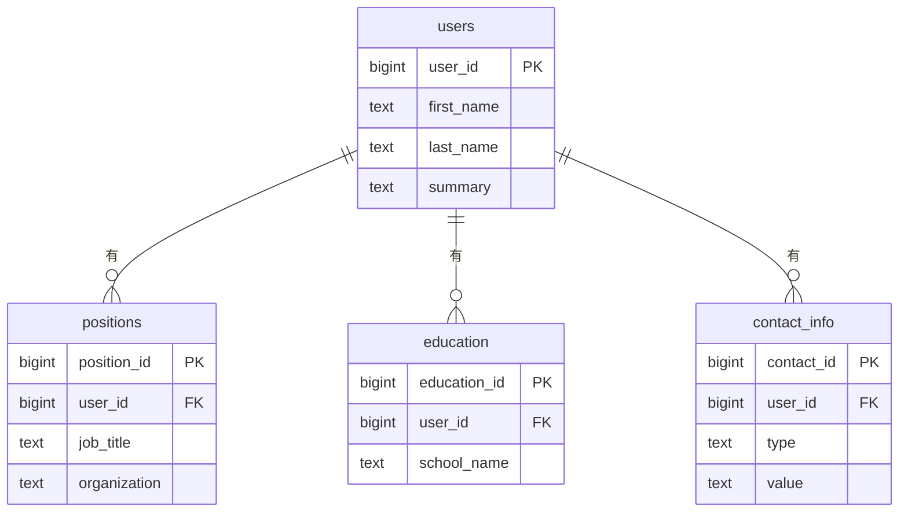
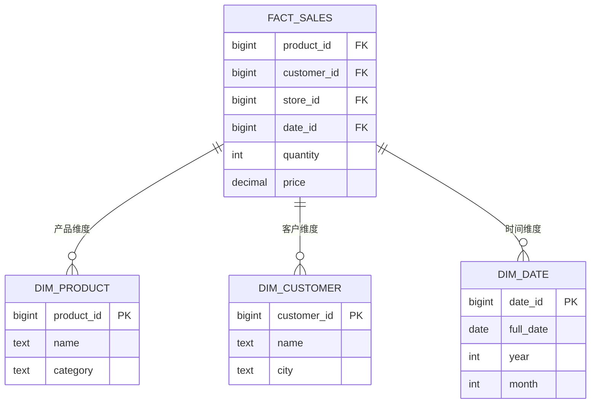
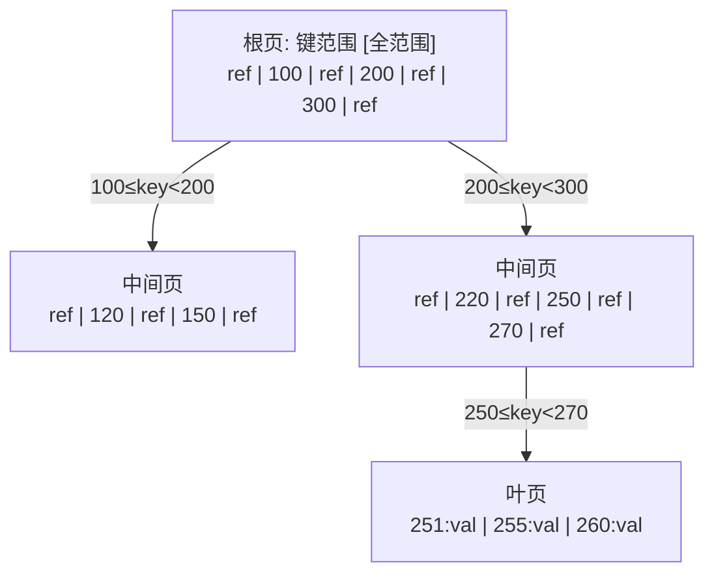
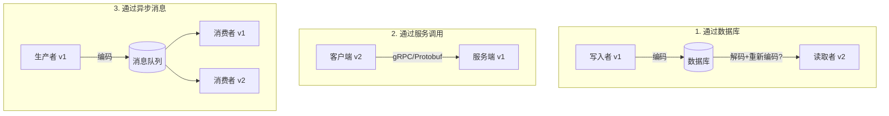

# 《设计数据密集型应用》读书笔记 · 第一部分：数据系统基础

> 来源：ddia.vonng.com（第二版中文翻译）
> 整理日期：2026-06-01
> 范围：第1章 — 第5章

---

## 第1章 · 数据系统架构中的权衡

### 核心命题
没有完美的解决方案，只有权衡取舍。本章建立全书的核心分析框架。

### 关键概念

**数据密集型 vs 计算密集型**
- 数据密集型应用：瓶颈在数据量、数据复杂度、数据变化速度
- 五大标准构件：数据库(存储) → 缓存(加速) → 搜索索引(查找) → 流处理(实时) → 批处理(批量)

**事务型系统(OLTP) vs 分析型系统(OLAP)**

| | OLTP | OLAP |
|---|---|---|
| 读模式 | 点查询（按键取少量记录） | 聚合查询（扫描大量记录） |
| 写模式 | 单条增删改 | 批量导入(ETL)或事件流 |
| 用户 | 终端用户 | 内部分析师/数据科学家 |
| 数据量 | GB ~ TB | TB ~ PB |
| 数据含义 | 当前状态 | 历史事件 |

### 数据仓库的 ETL 流程



> **图1-1 对应说明**：ETL 到数据仓库的简化流程。事务系统的数据被提取、清洗、转换后加载到数据仓库。SaaS 产品（CRM、信用卡处理等）通过 Fivetran 等专门连接器导入。有时先加载再转换（ELT），催生了数据湖仓（Lakehouse）架构。

**数据仓库 ↔ 数据湖 ↔ 数据湖仓**
- 数据仓库：关系模型 + SQL，面向业务分析师
- 数据湖：存原始文件，不限格式，面向数据科学家+分析师
- 数据湖仓(Lakehouse)：在数据湖上直接跑SQL查询(Hive/Presto/Trino/Spark SQL)
- ETL → ELT → 反向ETL（分析结果回流事务系统）

**记录系统 vs 派生数据系统**
- 记录系统（真相来源）：数据的权威版本，新数据首先写入这里
- 派生数据系统：对已有数据做转换/处理后的结果（缓存、索引、物化视图、训练好的模型）
- 区分不在工具本身，而在应用中的职责划分

### 云服务 vs 自托管

**选云的理由**：负载波动大（弹性扩缩容）、不熟悉运维该组件、想聚焦高层问题
**选自建的理由**：负载可预测时更便宜（尤其大批量稳定负载）、可深度定制优化、不被供应商锁定

**云原生的关键变化：**
1. 存储与计算分离（S3存数据 / 计算实例跑查询）
2. 多租户设计（共享硬件 → 更高利用率 → 需要隔离设计）
3. 运维角色转型：从管机器 → 管服务、选服务、集成服务

### 分布式 vs 单节点

**必须分布式的理由：** 容错/高可用、可伸缩性、降低异地延迟、法律合规(数据驻留)、弹性扩缩

**分布式代价：** 网络故障不可靠、调试困难（需可观测性工具OpenTelemetry/Zipkin/Jaeger）、分布式事务复杂

**核心原则：单机能搞定就不要分布式**。CPU/内存/磁盘持续变强，DuckDB/SQLite等单机方案能处理的工作负载越来越多。

### 数据系统、法律与社会
- GDPR（被遗忘权）vs 不可变日志 → 新的工程挑战
- 数据最小化原则 vs 大数据囤积哲学
- 存储成本 ≠ 云账单——还要算数据泄露/合规罚款的风险成本

### 本章一句话
**每种技术选择都有得失，你的工作是理解权衡维度，为具体场景找到最优解。**

---

## 第2章 · 定义非功能性需求

### 核心命题
功能性需求（做什么）和非功能性需求（做得怎么样）同样重要。本章聚焦后者的四个维度：性能、可靠性、可伸缩性、可维护性。

### 案例研究：社交网络首页时间线

这是贯穿全章的具体案例。假设数据规模：每天5亿帖子（~5700条/秒），峰值15万条/秒；平均每个用户关注200人，有200个粉丝。

#### 数据模型



> **图2-1 对应说明**：社交网络的关系模式。三个表：users（用户）、posts（帖子）、follows（关注关系，多对多）。

#### 首页时间线的两种策略



- **朴素方案**：每次请求 JOIN posts+follows（读时计算）→ 百万用户不可行。每用户查200个被关注者的帖子 → 每秒4亿次查询
- **物化方案**：发帖时扇出写入每个追随者时间线（写时预计算）→ 读取极快。平均扇出因子200，每秒约100万次写入（远小于4亿次）
- **名人问题**：海量追随者的帖子不扇出，读时合并 → **混合策略**
- **启示**：规范化和反规范化不是非黑即白——最可伸缩方案往往是混合的

### 2.1 性能

**响应时间 ≠ 延迟**



> **图2-4 对应说明**：响应时间分解。服务时间是实际处理时间，延迟是请求未被主动处理的等待时间，响应时间是客户端感受到的总时间。排队延迟通常是响应时间波动的主因。

**响应时间 vs 吞吐量的关系**

```
响应时间 ↑
    |                          ╭─── 接近容量上限
    |                     ╭───╯    排队延迟急剧上升
    |                ╭───╯
    |           ╭───╯
    |      ╭───╯  ← 线性增长区
    | ╭───╯
    └──────────────────────────→ 吞吐量
```

> **图2-3 对应说明**：低吞吐量时响应时间低且稳定；接近系统容量时，排队效应导致响应时间急剧上升。当系统过载时可能进入恶性循环：响应慢 → 客户端超时重试 → 请求更多 → 更慢（重试风暴/亚稳态故障）。

**过载保护工具箱：**
- 客户端：指数退避（随机化重试间隔）、熔断器
- 服务端：负载卸除（主动拒绝超量请求）、背压（要求客户端降速）

**百分位点——比平均值有用得多**

```
请求排序（快→慢）：
  ▁▁▁▁▁▁▁▁▁▁▁▁▁▁▁▁▁▁▁▁▁▁▁▃▃▃▃▃▅▅▅▆▆▇█
  ├──── p50 ────┤               ← 中位数，典型用户体验
  ├──────────── p95 ────────────┤← 95%请求在此以内
  ├────────────────── p99 ──────┤← 99%请求在此以内
                                  █ = 尾部延迟（影响最有价值客户）
```

> **图2-5 对应说明**：100个请求的响应时间分布。大部分请求快，少量异常值极慢。p50=中位数反映典型体验，p95/p99用于衡量尾部延迟。

- p50（中位数）：典型用户体验
- p95 / p99：看清慢请求的严重程度
- p999：影响最有价值客户（数据量最大的用户通常最慢）
- **尾部延迟放大**：一个请求触发N次后端调用 → 只要1次慢，整个请求就慢

**尾部延迟放大示意：**



> **图2-6 对应说明**：即使只有1个后端调用慢（概率p），整个请求变慢的概率=1-(1-p)^N，远大于p。例如p=1%，N=100时，63%的请求会碰到至少一次慢调用。

### 2.2 可靠性

**故障 ≠ 失效**
- 故障 = 某个组件不正常工作（硬盘坏了）
- 失效 = 整个系统无法提供服务
- 区别在于观察层级：硬盘坏了对硬盘是失效，对有副本的系统只是故障

**硬件故障：**
- 机械硬盘年故障率2-5%，SSD年故障率0.5-1%
- 大规模集群里硬件故障是常态，不是意外
- 冗余有效但组件故障之间存在相关性（同一机架/数据中心可能一起出问题）

**软件故障比硬件故障更难处理：**
- 高度相关（同个bug影响所有节点）
- 潜伏期长（特定条件触发）
- 级联故障（一个组件挂了拖垮其他组件）
- 没有银弹，但通用措施有效：隔离进程、测试充分、避免正反馈环路

**人为错误：**
- 运维配置变更是中断首因（远超硬件故障）
- 解决方案：无责备事后分析、可快速回滚、渐进发布、良好界面设计防止误操作

### 2.3 可伸缩性

**关键不是"能扩容吗"，而是：**
1. 负载按什么方式增长时，有什么应对选项？
2. 如何增加资源承载额外负载？
3. 现有架构何时触顶？

**三种伸缩架构：**



**可伸缩性原则：**
- 把系统拆分成尽量可独立运行的小组件（微服务/分片/流处理的共同基础）
- 不提前为"也许未来需要"的规模做设计——过早优化适得其反
- 跨数量级增长时几乎必然要重新审视架构

### 2.4 可维护性

**软件成本大头在维护，不在初始开发。**

三维度：
1. **可运维性**：让团队轻松保持系统平稳运行（监控、文档、好默认值、自愈能力）
2. **简单性**：消除偶然复杂性 → 好的抽象是关键（如SQL抽象了磁盘/内存/并发/崩溃恢复）
3. **可演化性**：让系统随需求变化容易修改 → 松耦合、避免不可逆操作

### 本章一句话
**性能看百分位点，可靠性要容忍故障而非阻止故障，伸缩性靠拆分独立组件，维护性系于简单性和好抽象。**

---

## 第3章 · 数据模型与查询语言

### 核心命题
数据模型是软件最重要的部分——不仅影响代码怎么写，更影响你**怎样思考问题**。每一层通过提供简洁数据模型隐藏下层复杂性。

### 3.1 关系模型 vs 文档模型

#### 具体例子：LinkedIn简历的两种表示

**关系模式（图3-1）：**



**JSON 文档表示（示例3-1）：**

```json
{
  "user_id": 251,
  "first_name": "Barack",
  "last_name": "Obama",
  "headline": "44th President of the United States",
  "positions": [
    {"job_title": "President", "organization": "US Government"},
    {"job_title": "Senator", "organization": "Illinois"}
  ],
  "education": [
    {"school_name": "Harvard Law School"},
    {"school_name": "Columbia University"}
  ],
  "contact_info": [
    {"type": "email", "value": "..."}
  ]
}
```

**关系模型（SQL）：**
- 数据组织为关系（表），元组（行）的无序集合
- 强项：连接(JOIN)、多对一/多对多关系、模式约束保证数据一致性
- 弱项：与面向对象编程存在"阻抗不匹配"（ORM试图弥合但复杂）

**文档模型（JSON/NoSQL）：**
- 数据表现为自包含的JSON文档 → 树状结构
- 强项：局部性好（一次读整个文档）、模式灵活、与对象模型接近
- 弱项：多对多关系处理笨拙（需应用层JOIN或用ID引用）

**选型判断：**
- 数据是文档结构（一对多树、一次加载整棵树） → 文档模型
- 数据有多对多关系、需要连接 → 关系模型
- 不是非此即彼：多数关系数据库已支持JSON，文档数据库也支持$lookup类连接

**阻抗不匹配（Impedance Mismatch）：**
这个术语借自电子学。当两个电路的输出/输入阻抗不匹配时，信号会反射。类比到软件：面向对象的代码（对象、数组、嵌套结构）和关系表的行/列之间存在同样的"不匹配"。ORM（如ActiveRecord、Hibernate）试图弥合这个差距，但永远无法完全隐藏差异。

### 3.2 规范化 vs 反规范化

| | 规范化 | 反规范化 |
|---|---|---|
| 写入 | 快（只改一处） | 慢（多处更新） |
| 读取 | 慢（需要JOIN） | 快（数据在一起） |
| 一致性风险 | 低 | 高（副本可能不一致） |

**ID引用的优势**：ID对人无意义 → 永远不需要改 → 消除了级联更新问题
**直接存文本的优势**：不用JOIN，但更新时需要改所有副本

### 3.3 图数据模型
（略读，适合多对多关系密集型场景，如社交图、推荐系统）

### 3.4 分析数据库模式：星型与雪花型



**星型模式：**
- 中心 = 事实表（每行代表一个事件，列极多可达上百列）
- 外围 = 维度表（事件的谁、什么、哪里、何时、为什么）
- 面向业务分析师，大量使用JOIN但是可预测的模式

**雪花模式**：维度进一步拆分子维度 → 更规范化 → 但分析师偏好星型（更简单）

**宽表(OBT)**：把维度信息反规范化到事实表中 → 存储换速度

### 3.5 声明式查询语言的威力
- SQL/Cypher/SPARQL都是声明式——你说「要什么」，不规定「怎么做」
- 好处：查询优化器决定执行策略 → 数据库升级后查询自动变快
- 如果手写算法，并行执行需要大量额外工作

### 本章一句话
**选数据模型看关系类型：树状用文档，多对多用关系。规范化和反规范化本质是读写性能的权衡，不是道德判断。**

---

## 第4章 · 存储与检索

### 核心命题
数据库底层如何存储和检索数据？理解存储引擎才能针对你的工作负载做出正确选型。

### 4.1 底层原理：最简单的数据库
```bash
db_set() { echo "$1,$2" >> database; }          # 追加写 → O(1)，极快
db_get() { grep "^$1," database | tail -n 1; }  # 全表扫描 → O(n)，极慢
```
**核心洞察：** 写入最快的方式是追加到文件末尾。任何索引都会拖慢写入——这是根本权衡。

### 4.2 日志结构存储（LSM-Tree路线）

**思路：** 保持追加写入，但让读取变快。

**第一层：哈希索引（图4-1）**

```
内存哈希映射:                    磁盘日志文件:
┌──────────────┐                ┌─────────────────────┐
│ key → offset │                │ 42,{"name":"SF",...}│ ← offset 0
│ 42   →   64  │──────────────→ │ 33,{"name":"NY",...}│ ← offset 30
│ 33   →   30  │──→             │ 42,{"name":"SF",...}│ ← offset 64 (最新)
│ ...          │                │ ...                  │
└──────────────┘                └─────────────────────┘
```

> **图4-1**：内存哈希表记录每个key在日志文件中的最新字节偏移。查找时先查哈希表拿到偏移量，直接寻道读取。写入时追加到文件末尾，再更新哈希表。缺点：哈希表必须全部在内存、范围查询差、重启时需重建、旧数据不回收。

**第二层：SSTable（排序字符串表）+ 稀疏索引（图4-2）**

```
SSTable 文件 (按键排序):
┌──────────────────────────────────────────────────┐
│ 稀疏索引         │ 数据块(压缩)                    │
│ handbag   → [0]  │ [handbag:val][handful:val]...  │
│ handsome  → [100]│ [handsome:val][handy:val]...   │
│ headband  → [200]│ [headband:val]...              │
└──────────────────────────────────────────────────┘

查找 handiwork:
  1. 稀疏索引: handbag < handiwork < handsome
  2. 跳到 handbag 偏移, 扫描到 handiwork 或越过 handsome
```

> **图4-2**：SSTable按键排序。稀疏索引只记录每个块的首键 → 索引可以远小于全部键。每个数据块独立压缩（阴影区域），减少I/O。

**第三层：Memtable + 分段 + 合并压缩（图4-3）**

```mermaid
flowchart TB
    W[写入请求] --> M[内存表 Memtable<br/>红黑树/跳表, 内存中排序]
    M -->|达到阈值| F[刷写为SSTable段文件<br/>一次性写入磁盘, 之后不可变]
    F --> S1[段1 最新]
    S1 --> S2[段2]
    S2 --> S3[段3 最旧]
    S1 & S2 & S3 -->|后台归并排序| C[压实合并<br/>同key保留最新值<br/>丢弃墓碑标记]
    C --> N[新的合并段]

    读取: R[读请求] --> M
    M -->|未命中| S1
    S1 -->|未命中| S2
    S2 -->|未命中| S3
```

> **图4-3 对应说明**：合并过程类似归并排序——同时读取多个输入段，比较每个段的第一个键，复制最小的键到输出文件，重复直到全部合并。同key只保留最新值，墓碑标记最终被丢弃。

**布隆过滤器（图4-4）**：加速"键不存在"的判断

```
检查 SSTable 是否包含 key "handheld":

  键        → 哈希函数 → 位图索引
  handheld  → (6, 11, 2) → 检查位6:0, 位11:1, 位2:1
  有一个0 → 确定不存在！ 跳过此SSTable

  handbag   → (2, 9, 4)  → 检查位2:1, 位9:1, 位4:1
  全是1   → 可能存在 (假阳性概率~1%) → 仍需查SSTable
```

> 经验：每个key分配10位布隆过滤器空间 → 假阳性率1%；每多5位，假阳性率降10倍。

**压实策略对比：**
| | 分层压实(Size-tiered) | 分级压实(Leveled) |
|---|---|---|
| 原理 | 小SSTable合并到大SSTable | 键范围分成多个级别 |
| 写吞吐 | 高 | 较低 |
| 读效率 | 需查更多SSTable | 需查更少SSTable |
| 磁盘空间 | 需大量临时空间 | 更节省 |
| 适用 | 写多读少 | 读多写少 |

**代表性实现：** LevelDB、RocksDB、Cassandra、HBase、ClickHouse MergeTree

**LSM-Tree特点：**
- 优势：写入吞吐高（顺序写）、压缩效率高
- 劣势：压实过程会干扰读写性能、磁盘空间可能被未压实数据暂占

### 4.3 B树

**思路：** 就地更新。数据按固定大小页(通常4KB)组织，通过平衡树结构定位。



> **图4-5 对应说明**：查找键251。从根页开始，跟随边界200-300的引用到中间页，再跟随250-270的引用到叶页，最终定位键251。分支因子（每页子引用数）通常为几百。

**B树 vs LSM 核心区别：**

```
LSM-Tree:                               B-Tree:
  写入 → 追加新段(不可变)                 写入 → 就地覆盖页(可变)
  旧数据 → 合并时丢弃                     旧数据 → 被新数据覆盖
  页 = 可变大小的段(~MB)                  页 = 固定大小块(4~16KB)
  写入快(顺序写)                          读取稳(一次查B树)
```

**LSM vs B-Tree 总结：**
- LSM：写入快、压缩好 → 适合写入密集 + 磁盘空间敏感
- B-Tree：读取稳、事务成熟 → 适合读取密集 + 强事务需求

### 4.4 索引进阶

**聚簇索引**：数据本身存在索引中 → InnoDB的主键就是聚簇索引
**覆盖索引**：索引中存储部分列 → 某些查询只读索引就够了（不用回表）
**二级索引**：主键之外的索引 → 值可以重复（用行ID列表解决）

### 4.5 内存数据库
- 反直觉：优势不在于"避免读磁盘"（OS文件缓存也做这个）
- 真正优势：避免将内存数据结构编码为磁盘格式的开销
- 持久化仍需要（写日志/快照/复制），但读取纯内存

### 4.6 列式存储（分析型核心）

**核心洞察：** 分析查询通常只访问4-5列，但面向行存储需要加载整行（100+列）。

**行式 vs 列式存储（图4-7）：**

```
行式存储（OLTP优化）:                  列式存储（OLAP优化）:
┌─────────────────┐                    ┌─────────────────┐
│ Row0: id,name,age,city,... │        │ Col_age: 25,30,22,35,...   │
│ Row1: id,name,age,city,... │        │ Col_name: Alice,Bob,...    │
│ Row2: id,name,age,city,... │        │ Col_city: SF,NY,LA,...     │
└─────────────────┘                    └─────────────────┘
查询: SELECT AVG(age)                  查询: SELECT AVG(age)
需要加载所有行的所有列 ✅                只需加载 age 列 ✅
```

> **图4-7 对应说明**：列式存储将每列的所有值连续存储在一起。查询只需读取相关列，减少I/O数倍到数百倍。

**压缩利器：**
- 位图编码（图4-8）：列中不同值的数量通常很少 → 每个不同值用一个位图表示（某行有该值则位为1）
- 游程编码：排序后相同值集中出现 → `product_id 6: run of 45 rows`
- 向量化处理：一次处理一批数据，利用CPU SIMD指令 → 比逐行处理快一个数量级

**现代分析栈（数据湖仓）：**
- 存储格式：Parquet, ORC（列式文件格式）
- 表格式：Apache Iceberg, Delta Lake（管理哪些文件构成表 + 时间旅行 + 事务）
- 查询引擎：Trino, Presto, DataFusion（独立于存储的计算引擎）

### 4.7 分析师记忆锚点：用日常场景记住存储引擎

> 以下不是原理补充，而是帮你把上面的概念「钉」在每日工作中——每次碰到这些场景，自动对应回存储层的逻辑。

**场景一：为什么 StarRocks 批量导入百万行很快，逐行 UPDATE 一条就很慢？**

你日常：`INSERT INTO ... SELECT ... FROM ...` 几百万行几秒搞定；但 `UPDATE ... SET status=1 WHERE id=12345` 感觉比 MySQL 慢得多。

对应原理：LSM-Tree（4.2节）。StarRocks 底层是追加写——新数据写入 Memtable，攒满后顺序刷盘成一个新的 SSTable 段。顺序写磁盘 ≈ 内存随机写速度。但 UPDATE 不会原地修改——它写一行新版本（标记旧版本为删除），真正的物理删除靠后台 Compaction。频繁单行 UPDATE = 产生大量需合并的小文件 + Compaction 开销累积。

肌肉记忆：**StarRocks = 日志本，只往后翻页写新内容，不要往前翻页改旧内容。要改也是贴个便签说"第5页作废"，等周末大扫除（Compaction）才真正撕掉。**

---

**场景二：为什么 MySQL 查 `WHERE id=12345` 瞬间返回，但 `SELECT city, SUM(amount) GROUP BY city` 查一个月就很慢？**

你日常：线上库查单个用户订单体验丝滑，但做周报时直接查线上库就卡死。

对应原理：行式存储 + B-Tree 索引。MySQL InnoDB 把一行的所有列紧密存在一起，B-Tree 按主键排序。`WHERE id=12345` 是 B-Tree 的拿手好戏——4层树就能定位百万行中的一行，只读4个页（16KB）。但 `GROUP BY city` 时需要把一个月所有行的 city 列从每行里抠出来——每行可能有 50+ 列，你要的 city 只是整行数据的 1/50，但物理上不得不全部读进内存再扔掉 49/50。这就是"行存对 OLAP 的根本不适配"。

肌肉记忆：**MySQL = 图书馆的索引卡片柜，找一本书极快；但要统计"2026年所有书名含'数据'的书有多少页"——你得把每一本书从架上搬下来翻。**

---

**场景三：为什么 SELECT 3列 从 30列宽表 跑得很快？**

你日常：宽表几十列，但业务查询往往只取其中三五个字段，直觉上"要全扫一遍"，但实际很快。

对应原理：列式存储（4.6节）。Parquet/ORC 把同一列的所有值存在连续的磁盘区域。`SELECT city, SUM(amount) FROM wide_table`——引擎只访问 `city` 和 `amount` 两个列文件，其余 28 列的数据块根本不碰。你的物理 I/O 约等于 2/30。

肌肉记忆：**列存 = Excel 不是一行一行存的，是按列存的——A列一整列放一起，B列一整列放一起。你要 A列+B列，就只碰这两块数据，F列到Z列完全不动。**

---

**场景四：为什么刚 DELETE 的数据还能被查到？**

你日常：执行了 DELETE，但紧接着的 SELECT 还能看到那条数据。过几分钟再查，消失了。

对应原理：LSM-Tree 的删除不是真实删除——写入一个「墓碑标记」（tombstone），标记该 key 已删除。后台 Compaction 合并 SSTable 时碰到墓碑，才真正丢弃旧数据。如果 Compaction 还没跑到这个段，数据仍可读。

肌肉记忆：**StarRocks 的 DELETE = 立个"此位已删"的牌子。真正的物理回收等到 Compaction（后台大扫除）。查数据时如果还没扫除到这，你还能"看到"它。**

---

**场景五：为什么查一个表中不存在的 user_id 也很快？**

你日常：`SELECT * FROM orders WHERE user_id = 99999999`——表里肯定没这个人，但返回"0行"几乎是瞬间的。

对应原理：布隆过滤器（4.2节）。LSM-Tree 每个 SSTable 文件带一个布隆过滤器——一个紧凑的位图，可以确定地告诉你"这个 key 不在此文件中"。查询先问布隆过滤器，它说"没有"就直接跳过这个文件，不需要真正的磁盘查找。只有它说"可能有"（1%假阳性）才真正打开文件扫描。

肌肉记忆：**布隆过滤器 = 每个文件封面上贴的"本册包含名单"速查方阵。扫一眼方阵就知道"张伟不在本册"，直接翻下一册。偶尔误报（说在其实不在），但绝不会漏报（说不在就真的不在）。**

---

**场景六：为什么突然断电后 MySQL 能恢复，但 Redis 可能丢数据？**

对应原理：WAL（Write-Ahead Log）。存储引擎执行写操作前，先把变更记录到只追加的日志文件，这是崩溃恢复的唯一手段。B-Tree 有 WAL，LSM-Tree 的 Memtable 本身在内存中但有 WAL 保护。Redis 如果配置 `appendonly no`——没有 WAL，纯内存，断电即丢。

肌肉记忆：**WAL = 记账员的流水日记。还没誊写到正式账本（磁盘数据页）之前，先写在流水账上。断电后翻流水账就能重做未完成的操作。**

---

**场景七：为什么排序键（ORDER BY key）的选择直接影响查询性能？**

你日常：StarRocks 建表时指定 `DUPLICATE KEY(dt, city)`，此后 `WHERE dt='2026-06-01' AND city='杭州'` 几乎秒出；但 `WHERE user_id=12345`（不在排序键里）就很慢。

对应原理：排序键决定了数据在磁盘上的物理排列顺序（4.2节 SSTable + 4.6节列存排序）。按 `(dt, city)` 排序意味着同一日期+城市的数据在磁盘上连续排列——查询只需顺序扫一段连续区域。而 `user_id` 没在排序键里，值随机散布在所有数据块中，必须逐块跳跃扫描。

结合列存压缩的加成：列存中按 city 排序后，city 列变成 `[杭州,杭州,...,北京,北京,...]`——相同值连续排列，游程编码压缩后 city 列可能只占原来的 1/10。

肌肉记忆：**排序键 = 字典的拼音索引。按拼音排了，查"zhang"就翻到对应那几页连续读。没按拼音排，你要从第一页开始一页页翻。**

---

**记忆口诀（七个场景压缩成三句话）：**

- **追加写快、原地改慢** → StarRocks 批量导入飞起、别拿来逐行 UPDATE
- **行存适合点查、列存适合扫描** → MySQL 查一行、StarRocks 算指标，各干各的不要混用
- **排序键 = 数据的物理排列** → 查询 hit 到排序键 = 顺序读 → 毫秒级；没 hit = 全表跳读 → 秒级

### 本章一句话
**OLTP用B-Tree或LSM（行式+索引），OLAP用列式存储。写入和读取的性能权衡贯穿所有存储引擎设计。**

---

## 第5章 · 编码与演化

### 核心命题
应用一定会变。变更时新旧代码、新旧数据格式会共存 → 必须同时保证向后兼容和向前兼容。

### 5.1 编码格式演化

**向后兼容（容易）：** 新代码能读旧数据
**向前兼容（更难）：** 旧代码能读新数据 → 需要旧代码忽略新增字段且不丢失它们

**数据比代码更长寿：** 5年前的数据还在数据库里，采用当时的编码格式。

### 5.2 编码格式对比

| | JSON/XML/CSV | Protocol Buffers | Avro |
|---|---|---|---|
| 模式 | 可选(JSON Schema) | 必须(强类型IDL) | 必须(动态获取) |
| 可读性 | 人类可读 | 二进制 | 二进制 |
| 字段名存储 | 每次编码都带字段名 | 用tag number代替 | 用字段位置/名称 |
| 编码大小 | 大(81B/示例) | 小(32B/示例) | 小(32B/示例) |
| 向前兼容 | 需手动处理 | tag number机制支持 | 读写端模式解析 |

**核心机制——Protobuf的tag number：**
- 每个字段有一个数字标签（`int64 favorite_number = 2;`）
- 编码时存的是tag number而非字段名
- 新字段加新tag → 旧代码碰到不认识的tag直接跳过 → 向前兼容

**核心机制——Avro的读写端模式：**
- 写入端用自己的模式写，读取端用自己的模式读
- Avro库对比两种模式，按字段名匹配 → 自动转换
- 新增字段设默认值 → 读到旧数据时补默认值

### 5.3 数据流模式

**三种数据流动方式，对兼容性要求不同：**



**1. 通过数据库：**
- 写入者编码 → 数据库存储 → 读取者解码
- 要求：最严。同一个值可能被新代码写入后被旧代码读取
- 数据库本身要做模式演化（添加带默认值的新列不必重写数据）

**2. 通过服务调用（REST / RPC）：**
- HTTP/REST：JSON为主 + OpenAPI描述API和模式
- gRPC：用Protobuf定义服务接口和消息格式
- 服务端先升级 → 客户端后升级 → 保证兼容

**3. 通过异步消息（消息队列/事件流）：**
- 生产者编码 → 消息队列暂存 → 消费者解码
- 消息可能被多个消费者(不同版本)消费 → 通常向前兼容更重要

### 5.4 RPC的本质问题

**RPC试图让远程调用看起来像本地函数调用——但这是根本性错误：**
- 网络不可靠：请求/响应可能丢失 → 不能假设调用一定成功
- 超时无意义：不知道是服务没收到还是响应丢了
- 重试不安全：可能造成重复执行
- 延迟不可预测：比本地调用高几个数量级

### 本章一句话
**编码格式的关键取舍是可读性vs效率vs兼容性。让系统可演化，需要在模式设计时就考虑向前/向后兼容。**

---

## 第一部分总结：核心思维框架

1. **权衡无处不在** —— 读写性能、规范化vs反规范化、一致性vs延迟、云vs自建
2. **抽象是关键武器** —— 好的抽象隐藏复杂性，让上层不用关心底层细节
3. **规模改变一切** —— 小数据量下表现好的方案，大10倍可能完全失效
4. **变化是常态** —— 从编码格式到数据模型到系统架构，都要为演化而设计
