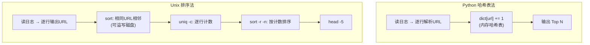
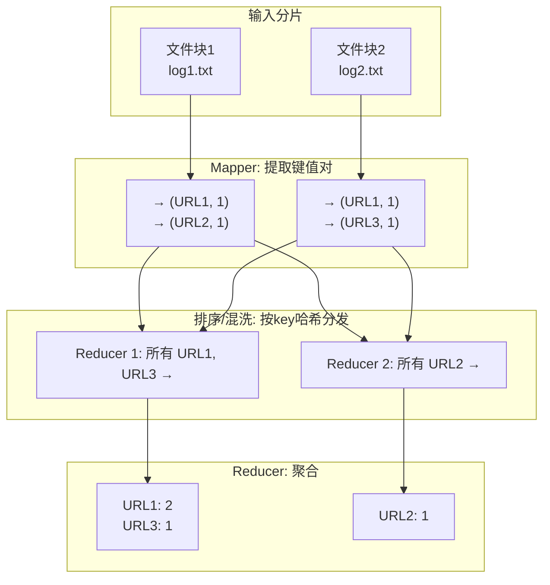
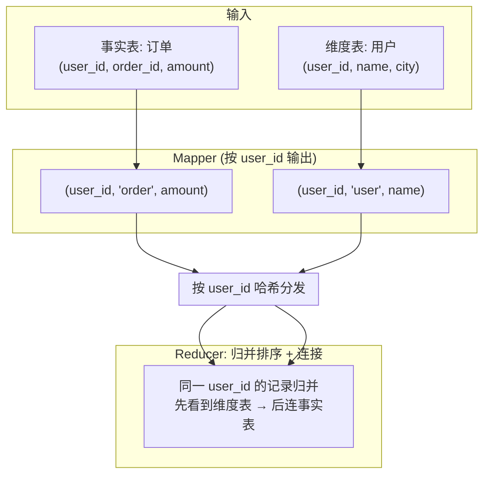
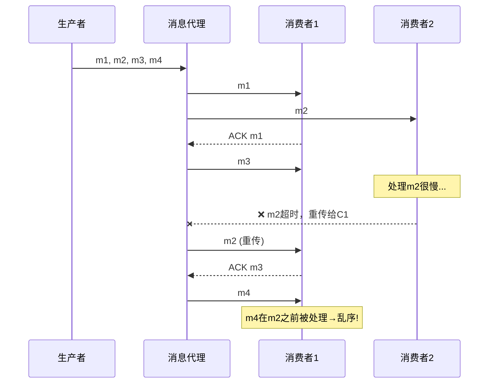
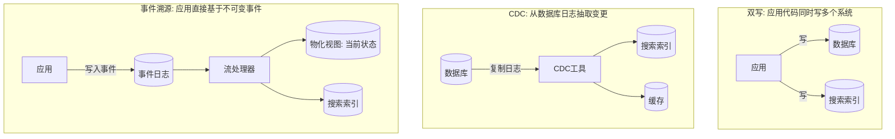
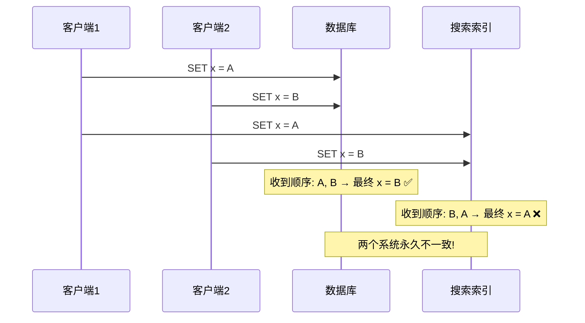
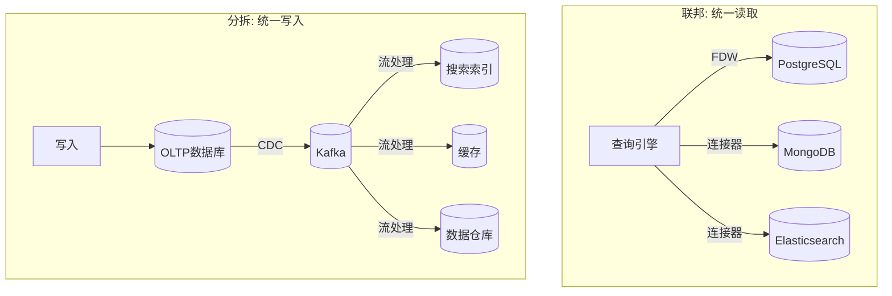
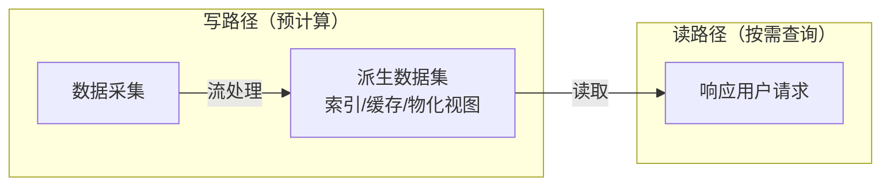
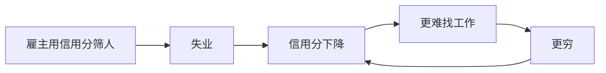

# 《设计数据密集型应用》读书笔记 · 第三部分：派生数据

> 来源：ddia.vonng.com（第二版中文翻译）
> 整理日期：2026-06-01
> 范围：第11章 — 第14章

---

## 第11章 · 批处理

### 核心命题
在线系统（请求/响应，低延迟）满足不了所有需求。当数据量大到需要小时级以上的计算时，需要**批处理**——读取一批输入，生成一批输出，输出完全由输入派生而来。

### 11.1 Unix工具哲学：批处理的微观缩影

**一个例子：** 用Unix管道找出网站最热门的5个页面
```
cat 日志 | awk '{print $7}' | sort | uniq -c | sort -r -n | head -5
```

**排序 vs 内存聚合（两种批处理范式的源头）：**



| | Python散列表法 | Unix排序法 |
|---|---|---|
| 原理 | 在内存维护URL→计数的哈希表 | 排序使相同URL相邻 → 逐条计数 |
| 适用场景 | 工作集 < 可用内存 | 工作集 > 可用内存（自动溢写磁盘） |
| 扩展性 | 单机内存上限 | 可处理超内存数据（GNU sort自动多核并行+磁盘溢写） |

Unix工具只在单机运行，数据超出单机容量时，需要分布式批处理框架。

### 11.2 分布式批处理框架 = 分布式操作系统

**类比：**
| 单机OS组件 | 分布式批处理对应 |
|---|---|
| 文件系统（ext4/XFS） | DFS（HDFS）或对象存储（S3） |
| 调度器 | YARN / Kubernetes |
| 管道 stdin/stdout | 数据流引擎（Spark/Flink） |
| VFS统一接口 | S3 API / HDFS协议 |

**分布式文件系统 vs 对象存储：**
| | DFS（HDFS） | 对象存储（S3） |
|---|---|---|
| 块大小 | 128MB | 4MB或更大 |
| 语义 | 文件系统（目录、硬链接、原子重命名） | 键值存储（没有真目录，重命名非原子） |
| 不可变性 | 支持修改 | 对象写入后通常不可变 |
| 计算位置 | 可将任务调度到数据所在节点 | 存储与计算解耦 |
| 缓存 | OS页缓存 + 各层缓存 | 各层缓存 |

### 11.3 作业编排与调度

**核心组件：**
- **任务执行器**（如YARN NodeManager、K8s kubelet）：拉起进程、心跳上报、资源隔离（cgroups）
- **资源管理器**：维护集群全局视图（CPU/GPU/内存/磁盘），依赖ZooKeeper/etcd
- **调度器**：决定"哪个任务跑在哪个节点"——这是一个**NP-hard**问题，工程上只能用启发式算法

**工作流调度：** 多作业之间的依赖构成DAG，由Airflow/Dagster/Prefect管理跨作业依赖。大型组织内有50~100个作业的工作流并不罕见。

**故障处理：** 批处理的核心优势——输出完全由输入派生。任务失败只需删除部分输出并重跑，不像在线系统需要复杂的回滚。

### 11.4 MapReduce → 数据流引擎

**MapReduce四步——以URL计数为例：**



**混洗（Shuffle）的正确理解：**
- 不是"随机洗牌"——这里的shuffle产生**确定性的排序结果**
- 每个mapper为每个reducer维护一个本地有序文件，按key哈希分配
- reducer从所有mapper拉取属于自己的文件，归并排序后按键调用reducer
- 这是所有分布式连接和聚合的基础

**MapReduce的局限 → 数据流引擎（Spark/Flink）：**
| | MapReduce | 数据流引擎 |
|---|---|---|
| 中间状态 | 写DFS（慢） | 放内存/本地磁盘（快） |
| 阶段间 | 上游全完成下游才启动 | 输入就绪即可启动下游 |
| 排序 | 每对map-reduce之间默认排序 | 只在需要时排序 |
| 任务启动 | 每个任务起新JVM | 复用进程 |
| 算子灵活性 | 严格map/reduce交替 | 灵活组合 |

### 11.5 分布式Join与Group By

**排序合并连接（Sort-Merge Join）：**



- 连接两侧的mapper都按连接键输出 → 混洗保证同键进入同一reducer → reducer合并两侧有序记录
- 可利用**二次排序**保证reducer先看到维度表记录，再看到事实表记录

**SQL的回归：** Hive、Spark、Trino、BigQuery都以SQL为"通用语"。SQL不仅减少代码量，更重要的是让查询优化器可以自动选择连接算法、重排连接顺序。

### 本章一句话
**批处理的核心模式是"读输入→排序/混洗→聚合输出"，Unix管道是它的微观版，分布式数据流引擎是它的工业版。输出完全由输入派生这一特性，让它天然容忍故障和人为失误。**

---

## 第12章 · 流处理

### 核心命题
批处理假设输入是**有界**的（已知大小），但现实中数据持续产生、永不"完成"。**流处理**对无界数据做增量处理——事件到达即处理，无需等待固定时间分片。

### 12.1 消息传递系统

**三类系统对比：**

| | 直接传递（UDP/ZeroMQ/webhook） | 消息代理（AMQP/JMS） | 基于日志的代理（Kafka） |
|---|---|---|---|
| 持久性 | 无（消费者离线消息丢失） | 可配置（通常消费后删除） | 持久化到磁盘，消息不删除 |
| 消费模式 | 通常一对一 | 负载均衡 + 扇出 | 天然扇出；负载均衡按分区分配 |
| 消息顺序 | 保持（简单场景） | 重传会破坏顺序 | 分区内严格有序 |
| 回放历史 | 不支持 | 不支持 | 支持（任意偏移量开始） |
| 典型吞吐 | 低延迟 | 中等 | 数百万消息/秒 |

**AMQP消息乱序问题（图12-2）：**



> **图12-2 对应说明**：负载均衡 + 重传导致消息乱序。消费者2处理m2太慢导致超时，m2被重新分配给消费者1，但此时m4已在m2之前处理完毕。解决方案：死信队列（DLQ）——把坏消息移到旁路队列，不堵塞主链路。

**基于日志的消息代理 = 数据库复制日志的泛化：**
- 分区 + 单调递增偏移量 + 仅追加写入
- 消费者记录偏移量，类似数据库从库记录日志序列号
- 慢消费者不影响其他消费者（巨大运维优势）
- 20TB磁盘在满速250MB/s写入下可缓冲约22小时数据；实践中通常保留数天到数周

### 12.2 数据库与流

**核心洞见：数据库的变更本身就是事件流。** 复制日志是数据库写入事件的流。

**状态与流的关系（数学比喻）：**
```
state(now) = ∫ stream(t) dt       状态是流对时间的积分
stream(t)  = d state(t) / dt      流是状态对时间的微分
```
可变状态与不可变事件日志是一体两面。数据库存在的唯一理由是为了**读取性能**——日志已经包含了全部信息。

**保持系统同步的三种方式：**



| | 双写 | CDC | 事件溯源 |
|---|---|---|---|
| 原理 | 应用代码同时写多个系统 | 从数据库复制日志抽取变更 | 应用逻辑直接基于不可变事件 |
| 一致性 | ❌ 竞态（图12-4），可能永久不一致 | ✅ 按实际写入顺序 | ✅ 事件本身定义顺序 |
| 改动量 | 最小 | 较小（不改应用代码） | 大（架构变更） |
| 日志压缩 | 不适用 | 同主键只保留最新值 | 不可压缩（需完整历史） |

**双写的竞态问题（图12-4）：**



**日志压缩：** 后台扫描同键记录，只保留最新值。压缩后的日志大小取决于数据库当前内容，而非历史写入次数。这使得基于日志的消息代理可以作为持久性存储使用。

### 12.3 流处理的应用

**三种模式：**
1. **写入存储：** 将事件写入数据库/缓存/搜索索引（物化视图维护）
2. **推送给用户：** 报警、通知、实时仪表盘
3. **产生派生流：** 处理输入流，输出新流（流水线）

| 场景 | 代表系统 | 特点 |
|---|---|---|
| 复合事件处理(CEP) | Esper, Apama | 查询是长期存储的，事件流过查询——与数据库角色颠倒 |
| 流分析 | Storm, Flink, Kafka Streams | 窗口聚合，概率算法（HyperLogLog等）优化内存 |
| 物化视图维护 | Kafka Streams, ksqlDB | 索引=物化视图，缓存=物化视图 |
| 流上搜索 | Elasticsearch Percolator | 查询被索引，文档流过查询 |

### 12.4 时间推理（流处理中最棘手的问题）

**事件时间 vs 处理时间：**

```
事件时间:  事件实际发生的时间
处理时间:  系统处理事件的时间

示例: 用户在 12:00:00 点击购买
  → 网络故障，事件延迟到达
  → 系统在 12:05:30 才处理 ← 处理时间晚了5分30秒

重跑: 事件时间相同 → 结果确定性 ✅
      处理时间不同 → 结果不确定 ❌
```

> **图12-8 对应说明**：用处理时间定义窗口的问题——处理器重启后追赶积压消息时，处理时间窗口会显示虚假的流量尖峰。

| | 事件时间 | 处理时间 |
|---|---|---|
| 含义 | 事件实际发生的时间 | 系统处理事件的时间 |
| 确定性 | ✅ 重跑结果相同 | ❌ 受处理延迟影响 |
| 实现 | 需嵌入在事件中 | 直接用系统时钟 |

**窗口类型：**
```
滚动窗口: |───W1───|───W2───|───W3───|  固定长度，无重叠
跳动窗口: |───W1───|          固定长度 + 固定步长
            |───W2───|
              |───W3───|
滑动窗口: [──最近5分钟──]← 按事件触发，持续滑动
会话窗口: |─a─| |──b──|        按活动间隔自动分割
```

**滞留事件的处理：** 永远无法100%确定某窗口的所有事件都已到达。要么丢弃少量滞留事件，要么发布更正值。

### 12.5 流连接

| 类型 | 说明 |
|---|---|
| 流-流连接 | 两个输入流按连接键在时间窗口内匹配 |
| 流-表连接 | 流中的事件去查找数据库中的当前值（如汇率），结果不具确定性——因为重跑时数据库可能已变化 |
| 表-表连接 | 两个物化视图按相同键更新，底层是两路变更流的合并 |

### 12.6 容错

**关键区别：** 批处理可以失败后从头重跑（几分钟到几小时的作业），但已运行数年的流作业不可能从头重跑。

**解决方案：**
- **微批处理**（Spark Streaming）：把流切成小批，每批当作批处理执行
- **检查点**（Flink）：定期快照算子状态到持久存储，故障时从检查点恢复
- **幂等性**：确保操作执行多次效果相同，是恰好一次语义的基础

### 本章一句话
**流处理让数据处理从"定期批作业"进化到"事件到达即响应"。日志是关键抽象——它把数据库、消息传递和流处理统一在同一个范式下。时间推理（事件时间vs处理时间、窗口、滞留事件）是流处理中最需谨慎的部分。**

---

## 第13章 · 数据系统的未来

### 核心命题
没有一个系统能覆盖所有数据使用场景，因此不可避免地要组合多种工具。问题不在"要不要组合"，而在**如何组合**——是联邦（统一读取）还是分拆（统一写入）？

### 13.1 数据集成：联邦 vs 分拆

| | 联邦数据库（统一读取） | 分拆数据库（统一写入） |
|---|---|---|
| 思路 | 一个查询接口覆盖多个底层存储 | 通过事件日志同步写入到各专用存储 |
| 哲学 | 关系型传统：高级查询语言，优雅语义 | Unix传统：小工具各司其职，通过统一低层API（管道）通信 |
| 代表 | PostgreSQL Foreign Data Wrapper, Presto/Trino | Kafka + CDC + 流处理器 |
| 写入同步 | ❌ 没有解决 | ✅ 有序事件日志驱动 |
| 复杂度 | 查询接口实现复杂 | 运维多种基础设施 |



**分拆的优势——松散耦合：**
- **系统层面：** 异步事件流容忍个别组件降级。慢消费者不拖垮生产者。故障被抑制在本地，不像分布式事务那样放大故障。
- **人力层面：** 不同团队可独立开发、改进、维护各自的组件。事件日志提供足够强又足够通用的接口。

### 13.2 围绕数据流设计应用

**核心思想：将数据库视为被应用操纵的被动变量是错误的。** 正确模型是：应用代码响应状态变更，产生新的状态变更。就像电子表格——一个单元格公式的输入变化了，结果自动重算。

**写路径 vs 读路径：**



| | 写路径上多做工作 | 读路径上多做工作 |
|---|---|---|
| 示例 | 创建索引 | grep 扫描全量 |
| 写入成本 | 高 | 低 |
| 读取成本 | 低 | 高 |
| 适用 | 读多写少 | 写多读少 |

**索引、缓存、物化视图本质上是一回事：** 它们都在改变读路径与写路径的边界，用写入时的额外工作换取读取时的速度。

### 13.3 有状态、可离线的客户端

**从无状态客户端到有状态客户端：**
- 将设备上的状态视为**服务器状态的缓存**
- 服务器主动推送状态变更到客户端（EventSource/WebSocket）→ 写路径一直延伸到终端用户
- 客户端离线期间错过的事件，可通过消费者偏移量机制恢复

**端到端的事件流：** 一个设备上的交互 → 事件日志 → 流处理器 → 派生数据系统 → 另一台设备的UI更新。延迟可低至一秒内。

### 13.4 追求正确性：端到端原则

**核心论点：低层可靠性机制（TCP重复抑制、以太网校验和、WiFi加密）本身不足以确保端到端的正确性。** 应用本身需要采取端到端措施。

**典型案例——防止重复转账：**

```mermaid
sequenceDiagram
    participant U as 用户
    participant C as 客户端
    participant S as 服务器(API)
    participant DB as 数据库

    U->>C: 点击"转账100元"
    C->>S: POST /transfer (request_id=uuid-123)
    S->>DB: BEGIN; UPDATE balance; INSERT transfer; COMMIT
    DB-->>S: ✅ 成功
    S--xC: ❌ 响应超时(网络原因)
    Note over C: 用户看不到确认，再次点击
    C->>S: POST /transfer (request_id=uuid-123) ← 重试!
    S->>DB: INSERT transfer... ← 唯一约束阻止重复!
    DB-->>S: ❌ duplicate key
    S-->>C: ✅ 200 OK (幂等，已被处理)
```

```
TCP层 → 去重TCP包（仅在当前连接内有效）
数据库事务 → 去重事务（仅在当前连接内有效）
HTTP → 用户因超时手动重试POST（数据库事务管不到这里！）
```

**正确做法：端到端的操作标识符（如UUID作为request_id），利用数据库唯一约束确保同一操作最多执行一次。**

**唯一性约束需要共识：**
| 方案 | 原理 | 伸缩性 |
|---|---|---|
| 单节点领导者 | 所有请求走一个节点裁决 | ❌ 单点瓶颈 |
| 按唯一字段分区 + 日志 | 同键请求进同一分区，单线程顺序处理 | ✅ 分区数即并行度 |
| 异步多主 | 各主独立接受写入 | ❌ 可能同时接受冲突值 |

### 13.5 读也是事件

**将读取请求也表示为事件流** → 读事件与写事件进入同一流处理器 → 读请求变成了与数据库的流表连接。

这样做的好处：记录用户在做决策前看到了什么，可以追踪因果关系——例如分析显示"预计3天送达"对用户购买决策的影响。

### 本章一句话
**数据系统的未来不是一个大一统数据库，而是通过有序事件日志将专用存储系统松散耦合。正确性不能只靠底层机制，必须做到端到端——从客户端到数据库贯穿同一操作标识符。**

---

## 第14章 · 将事情做正确

### 核心命题
许多数据系统处理的是关于**人**的数据。技术本身无善恶，但如何被使用、如何影响人，是工程师无法回避的伦理责任。这是全书唯一不讨论技术架构的章节，但它可能是最重要的一章。

### 14.1 预测分析：算法决策的黑暗面

**"算法监狱"：** 当一个人被预测分析系统标记为"高风险"（还款违约、犯罪再犯、高额理赔），就可能被系统性排除在工作、航空、保险、住房之外。

**偏见与歧视：**
- 算法从历史数据学习，如果过去存在歧视，算法会将歧视**编码并放大**
- 一个人的邮编或IP地址可能成为种族的强预测因子——在按种族隔离的社区里尤其如此
- 讽刺说法：**"机器学习就像给偏见洗钱"**
- 数据和模型应该是我们的工具，不是我们的主宰

**反馈回路——恶性循环示例：**



| 例子 | 恶性循环 |
|---|---|
| 雇主用信用分筛人 | 失业→信用分下降→更难找工作→更穷→信用分更差 |
| 加油站算法定价 | 算法学会"合谋"，竞争减弱，消费者价格上涨 |

### 14.2 隐私与监视

**思想实验：把 data 换成 surveillance（监视）**
> "在我们这个监视驱动的组织中，我们收集实时监视流并存入监视仓库。我们的监视科学家使用先进的分析与监视处理来产出新洞见。"

**数据收集的关系转变：**
| 用户是客户 | 用户是被监视对象 |
|---|---|
| 用户明确输入、希望系统处理 | 用户在干别的事时被"顺带"追踪 |
| 服务执行用户指令 | 服务拥有自己的利益，可能与用户冲突 |
| 数据最小化 | 最大化数据收集 |

**隐私≠把一切保密。** 隐私是对自己数据的**控制权**——决定什么向谁披露。当数据通过监视基础设施被抽取时，被侵蚀的不是隐私本身，而是**隐私权从个人转移到了数据收集者**。

### 14.3 同意与自由选择

**"不同意就别用"的谬误：**
- 隐私政策晦涩到用户无法形成有意义的理解（GDPR要求同意必须freely given, specific, informed, unambiguous）
- 当某项服务成为社会参与所必需时（社交网络、搜索、智能手机），选择不用在事实上是**强制**参与
- 平台用游戏机制和赌博策略让用户反复回来
- 拒绝参与往往是少数特权人群的选项

### 14.4 数据作为资产与权力

**数据不是"新石油"，而是"新铀"**——既有价值又有毒：

> **图14-1（概念图）：数据价值链中的权力不对称**
>
> 个人(数据源头) → 平台(收集、聚合) → 广告商(货币化) → 政府(监控)
>    ↑__权力向数据持有者集中，数据主体失去控制权__↑

- 初创公司估值以"眼球"为基础 = 以监视能力为基础
- 公司破产时，个人数据作为资产被出售
- 数据泄露事件频发得令人不安
- 政府也想拿到数据：通过交易、胁迫、法律强制或直接窃取

### 14.5 工业革命的类比

| 工业革命 | 信息时代 |
|---|---|
| 空气污染（烟尘） | 数据污染（隐私侵蚀、监视） |
| 水污染（工业废弃物） | 信息废弃物（数据泄露、滥用） |
| 童工、恶劣工作条件 | 用户被当作可优化指标 |
| 花了几十年建立环保法规 | 数据保护法刚刚起步 |

**Bruce Schneier：** "数据是信息时代的污染问题，而保护隐私是环境挑战。我们的后代将回望信息时代的早期几十年，并以我们如何应对数据收集与滥用的挑战来评判我们。"

### 14.6 我们该做什么

1. **停止把用户当作可优化指标**——他们是应被尊重、拥有尊严与主体性的人
2. **自律约束数据收集**——不要只做"法律允许的"，要做"对用户好的"
3. **教育终端用户**——让他们知道数据如何被使用，而不是蒙在鼓里
4. **保护隐私权**——让个人保留对自身数据的控制权
5. **考虑未来所有可能的政府**——你今天收集的数据可能落入明天的极权政权手中
6. **最小化不可逆性**——"如果代码出错导致坏数据写入数据库，回滚代码不能修复已写入的数据"

### 本章一句话
**技术从业者如果不考虑自己工作的社会影响，就是没有尽到本职。数据系统工程师的伦理责任与建筑工程师一样真实——只不过我们构建的是塑造人们生活的数字世界。**

---

## 第三部分总结：核心思维框架

1. **派生数据是统一主题** —— 批处理的输出、流处理的物化视图、搜索索引、缓存，都是从一个"记录系统"派生出的数据表示，区别只在计算时机（批vs流）和更新频率
2. **日志是关键抽象** —— 不可变的、有序的事件日志将数据库、消息传递、流处理统一在同一范式下。状态是流的积分
3. **写路径与读路径的权衡** —— 索引、缓存、物化视图都在做同一件事：用写入时的额外工作换读取时的速度
4. **正确性是端到端的责任** —— TCP、数据库事务等低层机制不能保证端到端正确性。操作标识符、幂等性、唯一约束必须贯穿全链路
5. **松散耦合优于强耦合** —— 异步事件日志驱动的分拆架构比同步分布式事务更稳健、更可演化
6. **伦理不可回避** —— 处理关于人的数据时，隐私、公平、问责不是"合规检查清单"，而是需要持续反思的工程责任

---

> 全书完。第1-5章（基础）、第6-10章（分布式）、第11-14章（派生数据）三部分笔记全部完成。
