# 《设计数据密集型应用》读书笔记 · 第二部分：分布式系统的挑战

> 来源：ddia.vonng.com（第二版中文翻译）
> 整理日期：2026-06-01
> 范围：第6章 — 第10章

---

## 第6章 · 复制

### 核心命题
在多台机器上保留相同数据的副本。困难不在于复制本身，而在于处理复制数据的**变更**。

### 6.1 单主复制（最常用）

**架构：** 一个领导者（接受写入） → 多个追随者（只读副本）

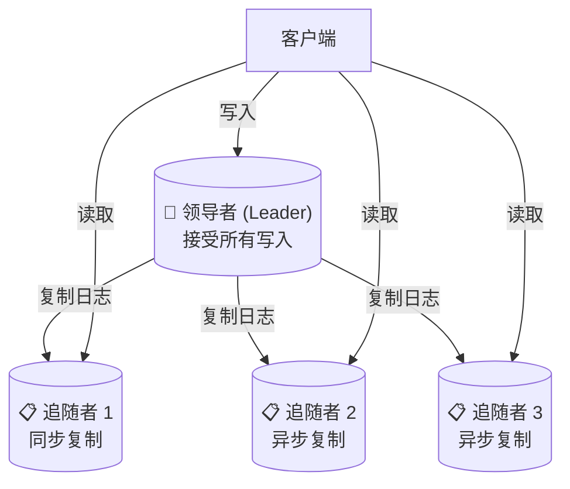

> **图6-1 对应说明**：单主复制。所有写入必须走领导者，领导者通过复制日志将变更传播给追随者。客户端可以从领导者或任何追随者读取。

**同步 vs 异步复制：**

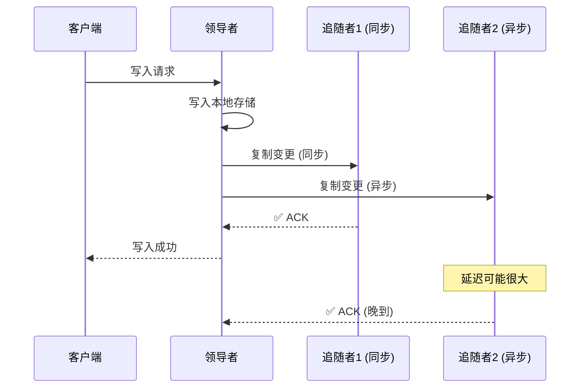

> **图6-2 对应说明**：同步追随者确认后才报告用户成功；异步追随者不需要等待。实践中通常1个同步+多个异步（半同步），既保证至少2个节点有最新数据，又不被慢节点拖垮。

| | 同步复制 | 异步复制 |
|---|---|---|
| 优点 | 追随者保证有最新数据 | 领导者不受追随者影响，写入快 |
| 缺点 | 一个追随者挂了，整个系统阻塞 | 领导者故障时，未复制的写入可能丢失 |
| 实践 | 通常只设1个同步追随者（半同步） | 大多数追随者配置为异步 |

**故障处理：**
- 追随者故障 → 追赶恢复（从日志中断点继续拉取）
- 领导者故障 → 故障转移（选举新主），充满风险：脑裂、数据丢失、超时设置

**三种复制日志实现：**
| 方法 | 原理 | 缺点 |
|---|---|---|
| 基于语句 | 转发SQL语句 | 非确定性函数(NOW/RAND)导致不一致 |
| WAL传输 | 发送磁盘块变更 | 与存储引擎耦合，无法滚动升级 |
| 逻辑日志(行级) | 记录行粒度的INSERT/UPDATE/DELETE | **推荐**，解耦存储引擎，支持CDC |

### 6.2 复制延迟的三大问题

**读扩展架构：** 写入走领导者，读取分散到追随者 → 异步复制带来延迟

**① 读己之写（Read-Your-Writes）**

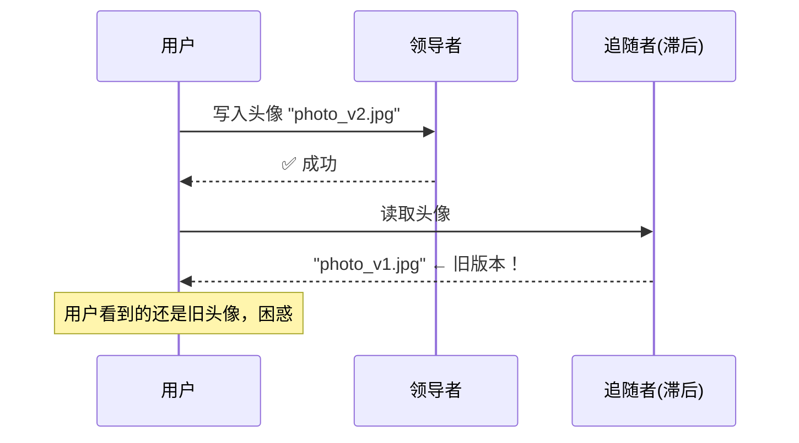

- 问题：用户写入后立即读取，可能从滞后副本读到旧数据
- 方案：用户自己的数据从领导者读；或记住最近写入时间戳，确保副本足够新

**② 单调读（Monotonic Reads）**

```
时间 → 第1次读:  副本A → 看到 photo_v2 (新)
       第2次读:  副本B → 看到 photo_v1 (旧) ← 时间倒退！
```
- 问题：两次读取路由到不同副本，先看到新值，后看到旧值
- 方案：同一用户始终路由到同一副本（按用户ID哈希）

**③ 一致前缀读（Consistent Prefix Reads）**

```
因果顺序:  问题: "你叫什么名字？"  →  回答: "我叫张三"
用户看到:  回答: "我叫张三"      →  问题: "你叫什么名字？"  ← 因果颠倒
```
- 问题：因果相关的写入在不同分片上复制速度不同
- 方案：确保因果相关的写入进入同一分片

**关键原则：** 不要假设异步复制像同步一样工作。做假设会在系统承压时暴露问题。

### 6.3 多主复制

**适用场景：**
- 跨地域部署（每个地区一个主节点，本地写入低延迟）
- 离线优先/本地优先应用（每个设备是一个"主节点"）
- 实时协作编辑（Google Docs/Figma）

**单主 vs 多主（跨地域）：**
| | 单主 | 多主 |
|---|---|---|
| 写入延迟 | 跨地域往返 | 本地处理，感知低延迟 |
| 容网络分区 | 从节点区域无法写入 | 每个区域独立运行 |
| 一致性 | 强（可串行化） | 弱（可能冲突） |
| 冲突处理 | 不需要 | 必须处理 |

**冲突解决策略：**
- 最后写入胜利(LWW) — 简单但有数据丢失风险
- 应用层合并（如CRDT）
- 用户介入（提示用户手动解决）
- 版本向量追踪因果关系

### 6.4 无主复制（Dynamo风格）

无单点领导者，客户端直接向多个副本写入。

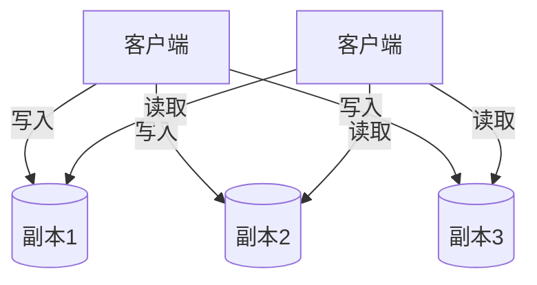

**仲裁读写：** n个副本，w个确认写入，r个确认读取
- `w + r > n` → 读写集合有重叠，保证读到最新值
- `w + r ≤ n` → 可能读到旧值

**故障恢复机制：**
- 读修复：读取时发现旧值，写回新值
- 反熵过程：后台进程持续比较副本差异

**检测并发写入：版本向量**
- 每次写入递增本节点计数器
- 版本向量记录所有节点的计数器集合
- 通过比较版本向量判断写入是并发还是在另一个之前

### 本章一句话
**复制方案从单主（简单/强一致）到多主（灵活/低延迟）到无主（高可用/弱一致），区别在于对"写入冲突"的处理方式和对"一致性"的取舍。**

---

## 第7章 · 分片

### 核心命题
数据量大到单机存不下时，需要把数据分割成更小的分片分布到多台机器上。分片是**重量级**操作，单机能搞定就不要分片。

### 分片与复制的组合

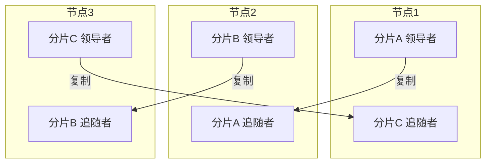

> **图7-1 对应说明**：每个分片的领导者分配到一个节点，追随者分散在其他节点。每个节点同时是某些分片的领导者和另一些分片的追随者。

### 7.1 分片的两种方法

**键范围分片 vs 哈希分片：**

```
键范围分片 (如 HBase):              哈希分片 (如 Cassandra):
  A-C  → 节点1                       hash("apple") % 6 = 2 → 节点2
  D-F  → 节点2                       hash("banana") % 6 = 4 → 节点4
  G-I  → 节点3                       hash("cherry") % 6 = 1 → 节点1
  J-L  → 节点4                       hash("date") % 6 = 5 → 节点5
  ...                                ...

优势: 范围扫描高效                   优势: 负载均匀
劣势: 写入热点(按时间戳时)           劣势: 范围查询需查所有分片
```

**键范围分片：**
- 分片 = 一段连续键范围（如 A-D / E-H / ...）
- 优势：范围扫描高效
- 劣势：写入热点（如按时间戳分片，当月分片过载）
- 代表：HBase、MongoDB、CockroachDB

**哈希分片：**
- 对分区键做哈希 → 分布到分片（如 `hash(key) % N`）
- 优势：负载均匀
- 劣势：范围查询失效（键顺序被打散）
- 代表：Cassandra、DynamoDB

### 7.2 再平衡策略

| 策略 | 原理 | 评价 |
|---|---|---|
| `hash % N` | 简单取模 | 节点数变化时大量数据迁移，极差 |
| 固定分片数 | 预创建大量分片，每个节点持有多个 | 节点增删只移动整个分片，好 |
| 哈希范围分割 | 分片太大时自动分割成子范围 | 灵活但操作昂贵 |
| 一致性哈希 | 节点和键都映射到环上 | Cassandra/ScyllaDB使用 |

### 7.3 热点处理

- 应用层打散：热键加随机后缀（如 `key_00` 到 `key_99`），读取时需聚合100个键
- 系统自动检测：DynamoDB的"自适应容量"

### 7.4 二级索引的分片

| | 本地索引 | 全局索引 |
|---|---|---|
| 索引覆盖范围 | 仅本分片 | 所有分片 |
| 读取 | 需查所有分片（分散/收集） | 单分片可查索引 |
| 写入 | 只改本分片 | 需改多个分片索引 |
| 代表 | MongoDB, Cassandra | CockroachDB, TiDB |

**本地索引读取示意（分散/收集）：**

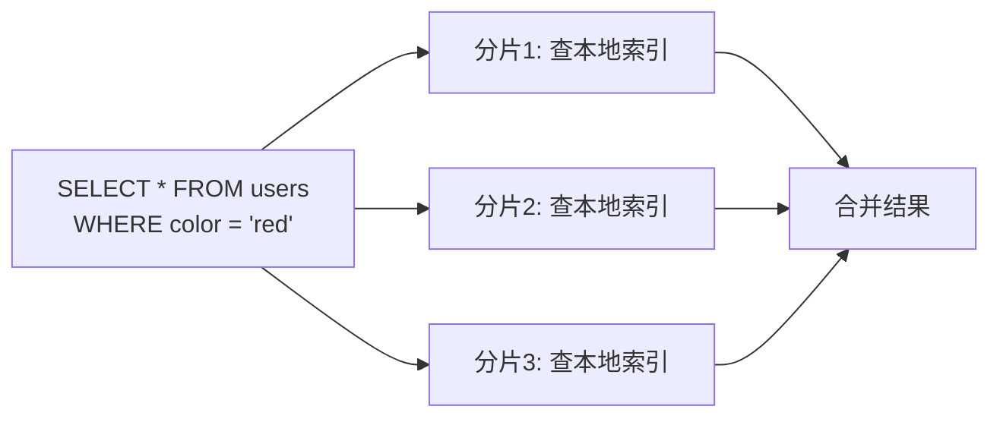

### 7.5 请求路由

客户端怎么知道该连哪个节点？
- 方案1：连任意节点，节点内部转发
- 方案2：路由层（分片感知的负载均衡器）
- 方案3：客户端直接知道分片分配（如Cassandra驱动）

**协调服务：** ZooKeeper/etcd维护分片→节点的映射，用共识算法防止脑裂

### 本章一句话
**分片让数据水平扩展成为可能，但代价巨大——二级索引要分散/收集，跨分片操作要分布式事务。只在确实需要时使用。**

---

## 第8章 · 事务

### 核心命题
事务是为**简化应用程序的编程模型**而创造的。它将多个操作打包成一个逻辑单元，要么全部成功（提交），要么全部失败（中止/回滚）。

### 8.1 ACID的含义（比你想的更模糊）

**A — 原子性（Atomicity）：「可中止性」**
- 不是并发的概念（那是I的职责）
- 含义：多个写入如果中途出错，已执行的写入必须被撤销
- **不是**多线程编程中的"原子操作"（那个是隔离性的事）

**C — 一致性（Consistency）：「应用程序不变式」**
- **五种不同含义**的同名概念（副本一致性、一致性哈希、CAP一致性、线性一致性、ACID一致性）
- 在ACID中指：数据满足应用程序定义的不变式（如会计借贷平衡）
- 依赖数据库约束（外键、唯一性、检查约束）或应用程序自身保证
- **是ACID中唯一不由数据库独立保证的属性**

**I — 隔离性（Isolation）：「可串行化」**
- 并发执行的事务彼此隔离，结果等同于串行执行
- 实践中大多数数据库用更弱的隔离级别（性能原因）

**D — 持久性（Durability）：「写入了就不会丢」**
- 单节点：写入非易失存储（fsync + WAL）
- 分布式：复制到多个节点
- 不存在绝对保证，只有多层降低风险（磁盘 + 复制 + 备份）

### 8.2 弱隔离级别（从弱到强）

```
隔离强度:
弱 ←─────────────────────────────────────────────→ 强
读未提交 → 读已提交 → 快照隔离 → 防止丢失更新 → 可串行化
(不用)   (默认)    (可重复读)  (原子操作/CAS)   (SSI/2PL)
```

**① 读已提交（默认级别）**
- 无脏读（看不到未提交的数据）
- 无脏写（不覆盖未提交的数据）
- 实现：写锁 + MVCC保留旧版本

**② 快照隔离（也叫可重复读）**
- 每个事务看到数据库的一致性快照（事务开始时的状态）

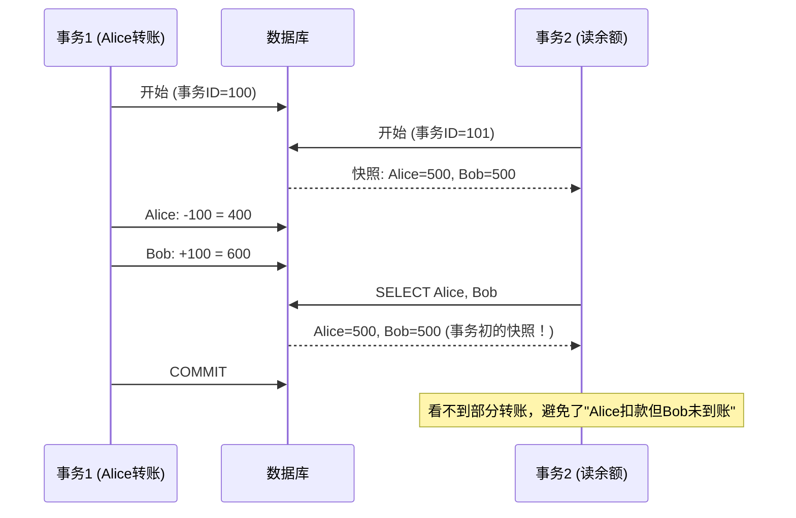

- 防止读取偏差（如转账时看到两个账户余额不一致）
- 实现：MVCC（多版本并发控制）——每行保留多个版本，用事务ID标记可见性
- **读者不阻塞写者，写者不阻塞读者**

**③ 防止丢失更新**
- 问题：读-修改-写循环中，后一个写入覆盖前一个写入

```
用户A: 读取 counter=5  →  计算 5+1=6  →  写入 counter=6
用户B: 读取 counter=5  →  计算 5+1=6  →  写入 counter=6  ← 应该是7！
```
- 方案：原子操作(`UPDATE SET counter = counter + 1`)、显式行锁(`SELECT FOR UPDATE`)、比较并设置(CAS)、自动检测

**④ 写偏差与幻读**

经典例子——两个医生同时批准值班请假：
```
规定: 至少1位医生值班
当前: Alice值班, Bob值班

医生Alice: 读 → 有2人值班 → 我可以请假 → 写入请假
医生Bob:   读 → 有2人值班 → 我也可以请假 → 写入请假
结果: 0人值班 ← 系统约束被破坏
```

- 写偏差：两个事务读取相同数据，基于读到的值做不同的写决定
- 幻读：一个事务中的两次相同查询返回不同的行集（因为另一个事务插入了新行）
- 解决：物化冲突（把查询条件变成一行上锁）、谓词锁、索引范围锁

### 8.3 可串行化的实现

| 方法 | 原理 | 瓶颈 |
|---|---|---|
| 实际串行执行 | 单线程逐个执行事务 | CPU单核上限 |
| 两阶段锁定(2PL) | 读共享锁+写排他锁，持有到事务结束 | 锁争用严重，吞吐低 |
| 可串行化快照隔离(SSI) | 乐观并发控制，检测事务间冲突再中止 | **现代主流方案** |

**SSI的优势：** 基于MVCC自带的事务依赖追踪，只中止真正有冲突的事务，无锁等待。

### 8.4 分布式事务

**两阶段提交(2PC)：**

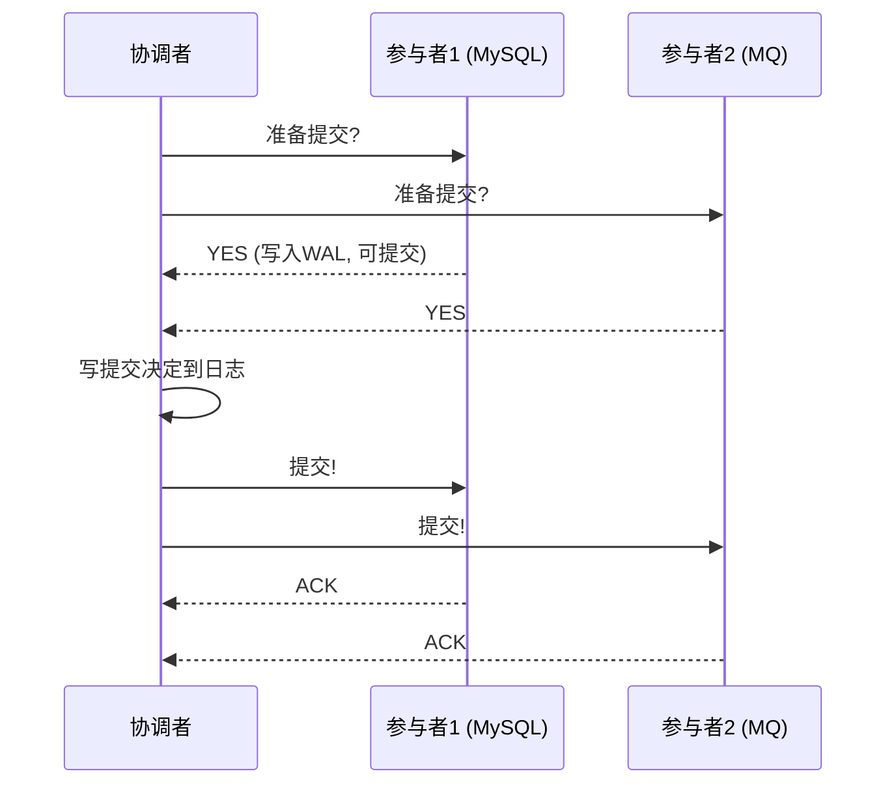

**关键风险：** 如果协调者在"写提交决定到日志"之后、"通知参与者提交"之前崩溃，参与者处于"不确定"状态，事务被阻塞。这就是为什么2PC协调者必须是高可用的。

| | 优点 | 缺点 |
|---|---|---|
| 2PC | 保证跨节点原子性 | 协调者单点故障会阻塞所有参与者 |

**XA事务：** 2PC的标准实现，跨异构数据库（MySQL + MQ），但运维复杂。

### 本章一句话
**ACID中真正由数据库保证的是A+I+D，C要靠应用自己。隔离级别从读已提交到可串行化，越强越安全但越慢，SSI是当前最佳平衡点。**

---

## 第9章 · 分布式系统的麻烦

### 核心命题
单机上要么工作要么不工作（确定性）。分布式系统中会出现**部分失效**（非确定性）——某些组件故障时其他组件仍在运行。这是分布式系统一切困难的根源。

### 9.1 不可靠的网络

**异步分组网络的核心困境（图9-1）：**

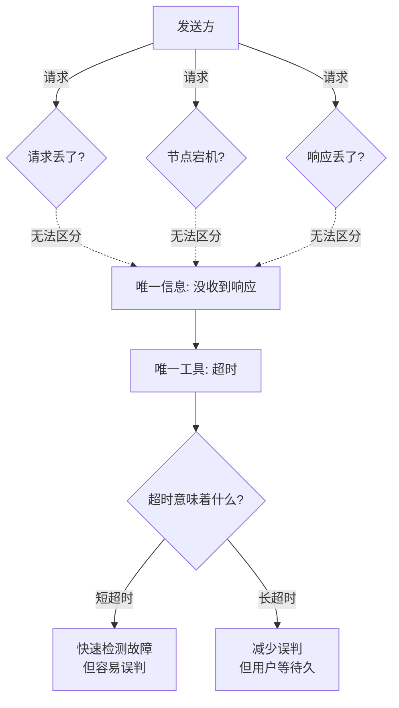

> **图9-1 对应说明**：发送请求后没收到响应，无法区分是请求丢失、远程节点宕机、还是响应丢失。三种情况对发送方完全不可区分。

**TCP也不可靠：**
- TCP保证重传丢失的数据包，但不能保证新包一定通过
- TCP确认只表示OS内核收到了（应用程序可能还没处理就崩溃）
- 需要**应用层响应**才能真正确认成功

**超时的核心矛盾：**
- 短超时 → 快速检测故障，但容易误判（临时负载峰值被当故障）
- 长超时 → 减少误判，但用户等待时间长
- **没有"正确"的超时值**——只能实测延迟分布并据此动态调整

**网络拥塞和排队（延迟可变性的来源）：**
1. 交换机队列满 → 排队 → 丢包
2. 目标CPU忙 → OS排队
3. 虚拟化暂停 → VMM缓冲
4. TCP拥塞控制 → 发送方限速
- 共享云环境中有"吵闹的邻居"效应

**为什么不用电路交换保证延迟？** 利用率太低。TCP/IP的分组交换是**利用率 vs 延迟确定性**的取舍。

### 9.2 不可靠的时钟

**两种时钟：**
| | 日历时钟 | 单调时钟 |
|---|---|---|
| 用途 | 时间点（几点几分） | 持续时间（多少秒） |
| 同步 | NTP同步，可能跳回 | 不需要同步 |
| API | `System.currentTimeMillis()` | `System.nanoTime()` |
| 分布式中的使用 | 不应用于排序 | 可用于测量超时 |

**时钟的问题：**
- 石英漂移：每天可达17秒
- NTP同步误差：互联网上最好35ms，拥塞时>1秒
- 闰秒、虚拟机暂停、用户恶意调整
- **不正确的时钟往往静默导致数据损坏而非崩溃**

**最后写入胜利(LWW)的危险：** Cassandra/ScyllaDB用客户端时间戳决定冲突保留哪个值 → 滞后时钟的节点写入会被静默丢弃

**正确做法：用逻辑时钟（计数器递增）代替物理时钟做事件排序**

**Google Spanner方案：** 用GPS接收器+原子钟使时钟不确定性降到~7ms，用TrueTime API返回置信区间 `[earliest, latest]`，提交事务前等待区间宽度以确保因果顺序。

### 9.3 进程暂停

**租约问题的典型场景：**

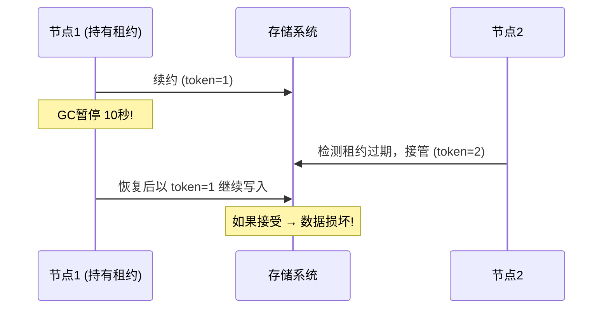

GC暂停、虚拟化暂停、磁盘I/O阻塞等都可能导致进程被"冻结"数秒甚至数分钟。

**解决：栅栏令牌**——每次租约变化时生成递增令牌，存储系统拒绝持有旧令牌的写入请求。

### 9.4 知识、真相与谎言

**拜占庭故障：** 节点不仅失效，还故意发送错误信息（可能是被攻击）

**大多数分布式系统不处理拜占庭故障**，因为代价太高。只在以下场景考虑：
- 加密货币/区块链
- 高安全环境（航空航天）
- 对等网络（节点可以伪造身份）

**系统模型：**
| 模型 | 网络假设 | 时钟假设 |
|---|---|---|
| 同步模型 | 有界延迟 | 无漂移 |
| 部分同步模型 | 通常正常，偶尔超界 | 通常同步，偶尔漂移 |
| 异步模型 | 无界延迟 | 无保证 |

**绝大多数实践算法基于部分同步模型设计**——允许偶尔的网络/时钟异常。

### 本章一句话
**分布式系统的核心困难是部分失效+非确定性。网络不可靠、时钟不可靠、进程会暂停——你必须假设这些都会发生并设计容错机制。**

---

## 第10章 · 一致性与共识

### 核心命题
面对故障时如何让系统仍然"正确"地工作？两个哲学方向：最终一致性（容忍不一致）vs 强一致性（表现得像单节点）。

### 10.1 线性一致性

**定义：** 系统表现得好像只有一份数据副本，所有操作原子地执行。

**关键保证（新鲜度）：** 一旦写入完成，所有后续读取必须看到新值（不允许读到旧数据）。

**具体例子（图10-1、10-2、10-3）：**

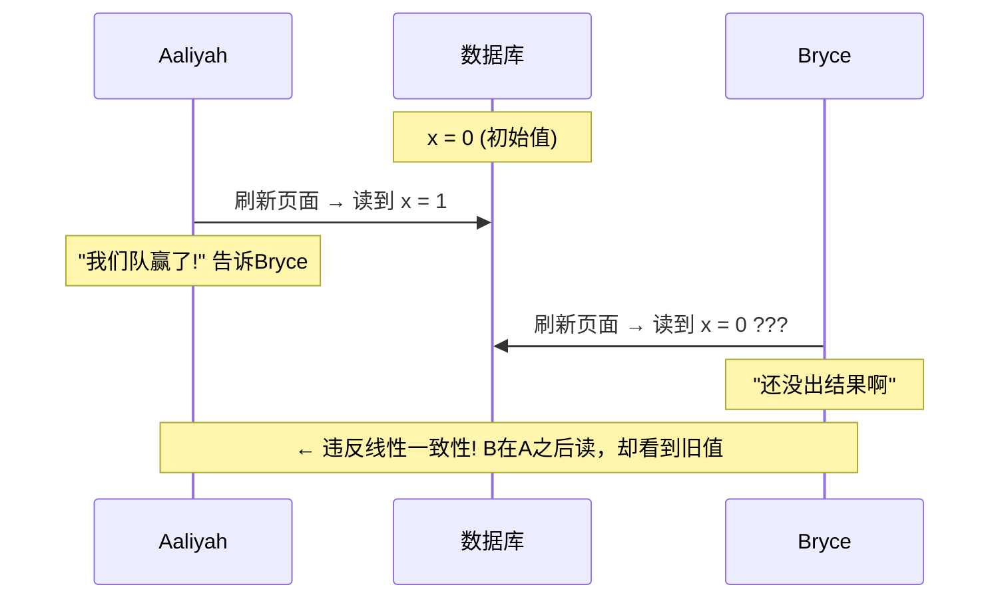

> **图10-1 对应说明**：体育比分网站。Aaliyah看到最终比分后告诉Bryce，Bryce随后刷新却看到旧数据——这违反了线性一致性。Bryce知道自己的读取在Aaliyah读取**之后**发生，必须看到至少一样新的数据。

**线性一致性的关键约束：每个操作必须在"被调用"和"收到响应"之间的某个时间点原子地生效。这些生效点必须连成一条永不后退的时间线。**

**线性一致性 ≠ 可串行化：**
| | 线性一致性 | 可串行化 |
|---|---|---|
| 范围 | 单个对象的读写 | 多个对象的事务 |
| 保证 | 新鲜度（不读到旧值） | 隔离性（不交错执行） |
| 过时读取 | 不允许 | 允许 |

**两者结合 = 严格可串行化**（最强保证）

**什么场景必须线性一致：**
- 领导者选举（不能有两个节点同时认为自己是主）
- 唯一性约束（用户名不重复、银行余额不为负）
- 跨通道时序依赖（文件存储 + 消息队列之间的竞态）

**各类复制能否线性一致：**
- 单主（可能） — 前提是确定唯一的真正主节点
- 共识算法（可能） — 如ZooKeeper、etcd
- 多主（不行） — 并发写入产生冲突
- 无主+Dynamo仲裁（通常不行） — w+r>n不足以保证，LWW更不行

### 10.2 线性一致性的代价

**性能代价：** Attiya-Welch定理证明，线性一致的读写响应时间至少与网络延迟的不确定性成正比。在可变延迟网络中，线性一致很慢。

**CAP定理（已被更精确理论取代）：**
- 错误表述："一致性、可用性、分区容错三选二"
- 正确理解：发生网络分区时，必须在线性一致性和完全可用性之间做选择
- 实际价值有限：定义太窄，范围太局限
- **更实用的理解：** 不需要线性一致性的应用能更好地容忍网络问题

**本质：** 放弃线性一致性更多是为了**性能**，而非容错。

### 10.3 ID生成与逻辑时钟

| 方法 | 唯一性 | 排序 | 性能 |
|---|---|---|---|
| 单节点自增 | ✅ | ✅ 完美 | ❌ 单点瓶颈 |
| 分片分配 | ✅ | ❌ 不确定 | ✅ 无协调 |
| UUID v4 | ✅ 高概率 | ❌ 随机 | ✅ 本地生成 |
| Snowflake/ULID | ✅ | ⚠️ 近似 | ✅ 本地生成 |
| Lamport时钟 | ✅ | ✅ 因果一致 | ⚠️ 需传递计数器 |

**Lamport时间戳：** `(计数器, 节点ID)` 对，每次生成或收到消息时递增本地计数器到max(本地, 收到)+1。提供与因果关系一致的全序。

### 10.4 全序关系广播与共识

**全序关系广播：** 确保所有节点以**相同顺序**处理相同的消息。等同于共识。

**共识算法的属性：**
1. 一致同意（所有节点决定相同的值）
2. 完整性（每个节点最多决定一次）
3. 有效性（决定的值必须是某个节点提议的）
4. 终止性（最终会做出决定）

**Raft（最广泛使用的共识算法）：**

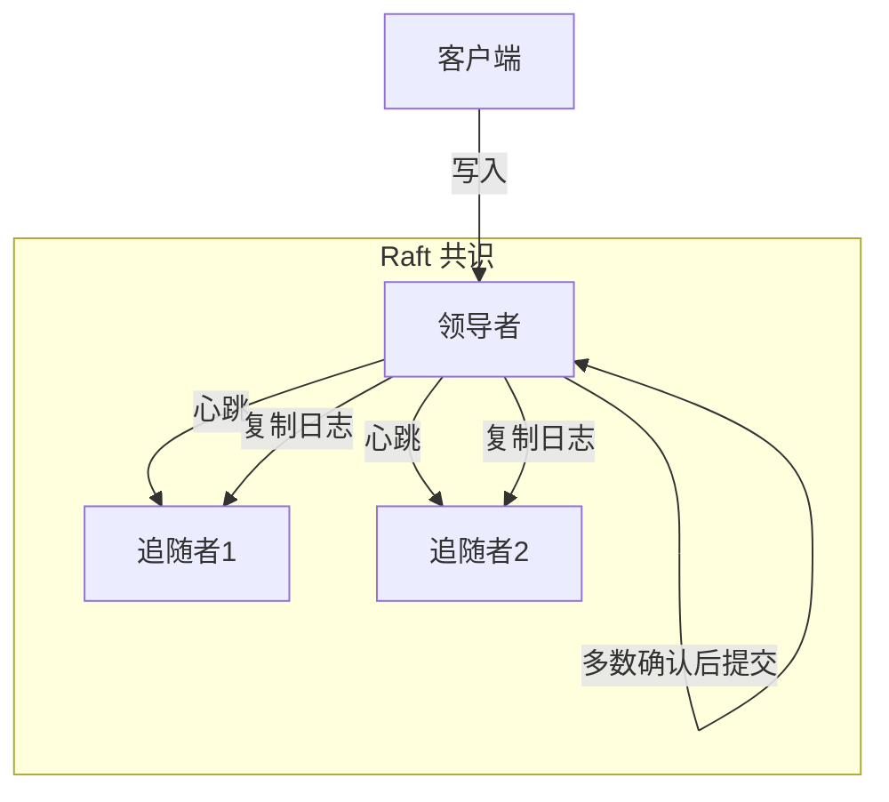

- 基于领导者，自动选举
- 心跳维持领导者身份
- 日志复制到多数节点后才提交
- 领导者崩溃 → 自动选举新领导者

**共识的实际应用：**
- ZooKeeper（Zab协议）、etcd（Raft）→ 协调服务
- CockroachDB、TiDB、YugabyteDB → 分布式事务
- Kafka → 控制器选举、分区领导者选举
- 分布式ID生成器

**共识的性能局限：**
- 所有消息必须通过领导者（网络往返不可避免）
- 大多数共识系统采用多数投票机制（需要等待最慢节点）
- 单个领导者负载可能成为瓶颈（可通过分片缓解）

### 10.5 分布式事务与共识

**共识支持两种分布式事务策略：**
1. **2PC + 共识选出事务协调者** → 协调者不再单点故障
2. **基于共识的事务**（如Percolator、Spanner） → 每个分片独立用共识处理事务

**成员与协调服务（ZooKeeper/etcd的用法）：**
- 领导者选举（临时顺序节点）
- 服务发现（节点注册 + 监控下线）
- 配置管理（Watcher机制通知变更）
- 分布式锁+栅栏令牌

### 本章一句话
**线性一致性让分布式系统表现得像单节点，代价是性能。共识算法是实现容错线性一致性的基石，Raft让它变得可理解可实践。**

---

## 第二部分总结：核心思维框架

1. **复制解决冗余问题，分片解决规模问题** —— 两者通常结合使用，每个分片多副本
2. **一致性不是免费的** —— 越强的一致性模型，越高的延迟和越低的可用性
3. **故障是常态，不是意外** —— 在大规模系统中，百万分之一的事件每天都在发生
4. **时钟和网络不可靠是物理约束** —— 没有技术手段能完全消除，只能设计容错
5. **共识算法是分布式系统的"硬核"** —— 一切需要强一致性的协调最终都依赖共识
6. **先判断是否需要分布式** —— 单机能搞定就不要分布式。单机性能在持续增长
