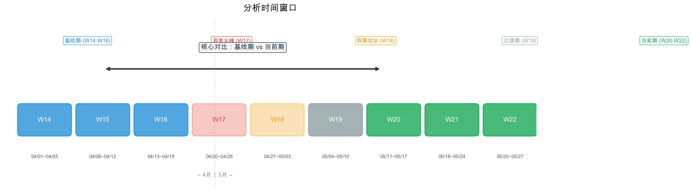
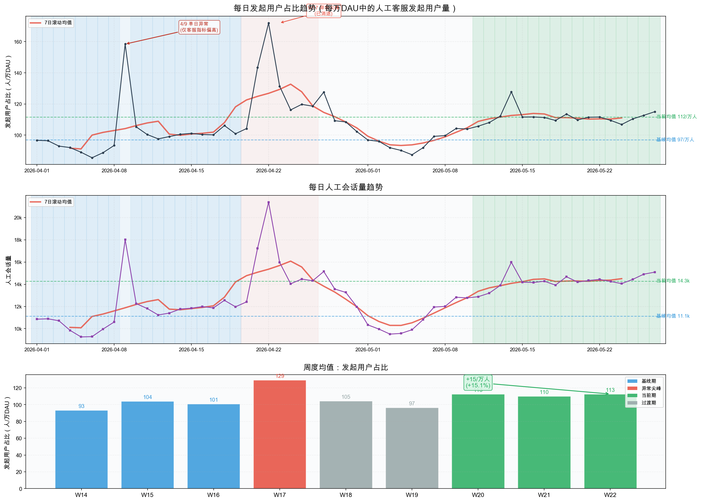
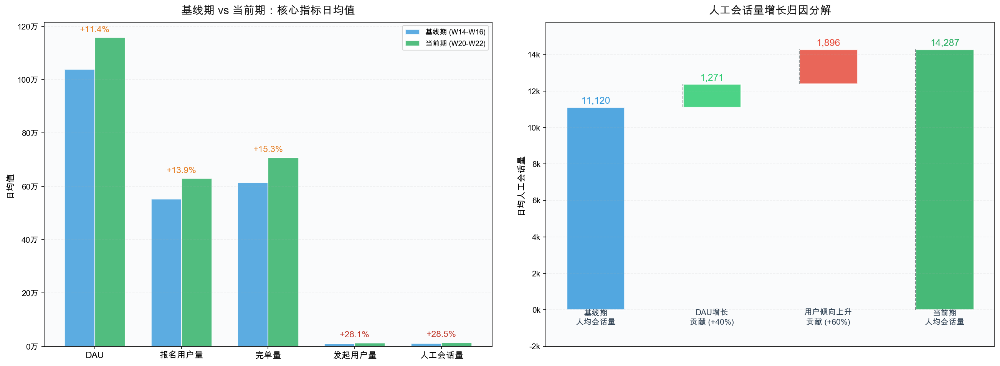
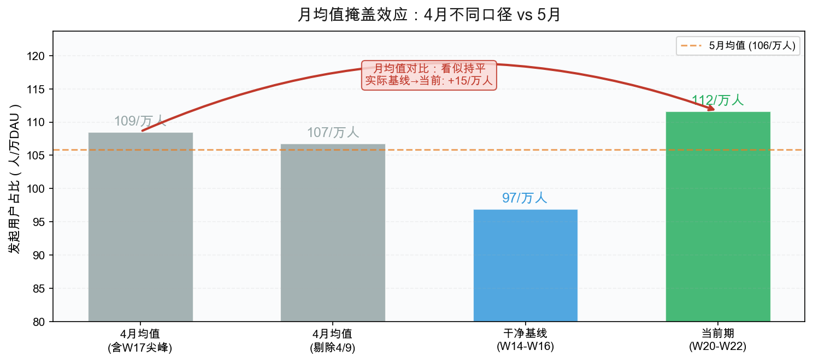
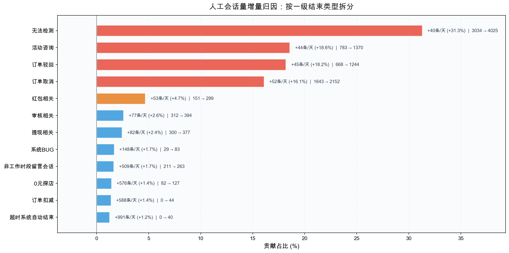
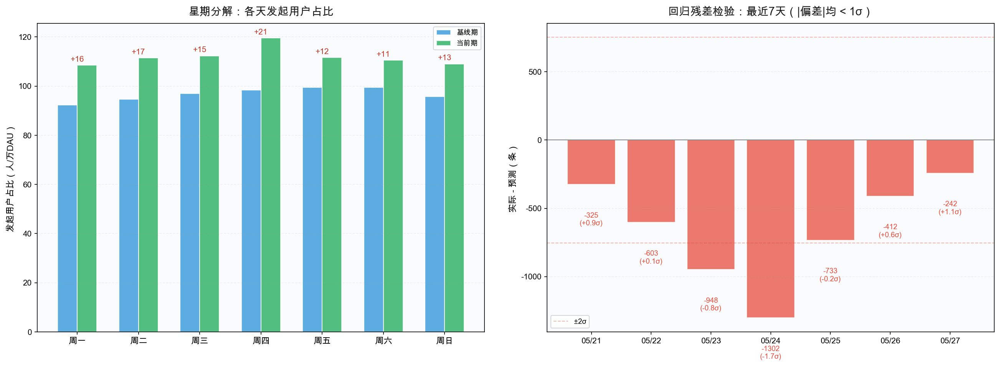
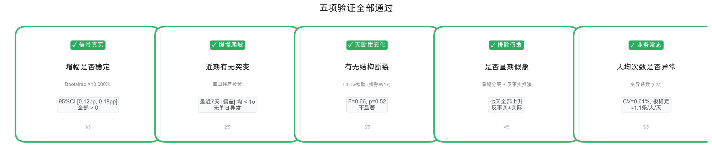

# 人工会话量异常判断分析

**日期**: 2026-05-28 | **数据范围**: 2026-04-01 ~ 2026-05-27（57天）

---

## 一、结论

### 会话量变多了，是正常的业务增长，还是真的有问题？

**两者都有，但都不是突发异常。**

**第一，用户量在涨，会话量跟着涨是正常的。** 4月初到5月下旬，DAU增长了11%，报名用户增长了14%，完单量增长了16%。用户池子变大了，客服会话量自然水涨船高。这部分贡献了约四成的增量。

**第二，但单位用户的「找客服倾向」也在缓慢爬坡。** 核心指标「发起用户占比」——即每万个活跃用户中有多少人当天找了人工客服——从4月上旬的约97人，升到了5月中下旬的约112人。5月份内部也还在逐周微幅上升。这部分贡献了约六成的增量。

这个上升有三个特征：

- **是缓慢爬坡，不是突然跳变。** 最近一周每天的实际值和预期值的偏差都在1个标准差以内，没有哪一天突然暴涨。
- **增幅的量级比较确定。** 用反复抽样的方式测算，4月上旬到5月下旬的增幅在0.12到0.18个百分点之间，区间较窄，说明这个上升信号是真实存在的，不是随机波动造成的假象。
- **没有证据表明4月和5月之间发生了断崖式的变化。** 排除4月底的异常尖峰后，两个月里「DAU涨多少、会话量就跟着涨多少」的关系并没有发生结构性的改变。当前更像是同一个趋势在缓慢地向上漂移。

### 一句话版本

> 会话量变多，一部分是因为用户量涨了（正常），一部分是因为用户找客服的倾向在缓慢爬坡（需要关注，但当下不紧急）。当前不是需要拉警报的状态，但应该持续观察。

### 建议

建立周度监控，每周看一眼「发起用户占比」（每万个活跃用户中有多少人找人工客服）。如果突破125人/万人（较当前112人/万人再涨约一成），或者连续3周只升不降，再启动排查。

---

## 二、口径

### 2.1 分析时间窗口



> **核心对比**：基线期（W14-W16，04/01~04/19，剔除4/9异常日）vs 当前期（W20-W22，05/11~05/27）。
> W17（异常尖峰）和W18（五一假期）不纳入核心对比。

### 2.2 指标定义

| 指标 | 计算方式 | 用途 |
|------|----------|------|
| **发起用户占比** | 人工会话发起用户量 ÷ DAU | **核心指标**——每万活跃用户中找客服的人数 |
| 人均会话量(DAU) | 人工会话量 ÷ DAU | 辅助指标 |
| 人均会话次数 | 人工会话量 ÷ 发起用户量 | 稳定性验证（≈1.1，几乎恒定） |
| 报名用户占比 | 报名用户量 ÷ DAU | 业务量参考 |
| 完单用户占比 | 完单用户量 ÷ DAU | 业务量参考 |

> **为什么用DAU做分母？** 人工会话发起用户是DAU的子集，两者同一口径，比例含义清晰。不能用「发起用户量 ÷ 报名用户量」——两者是DAU内两个独立子集，无用户级关联匹配时交叉相除无意义。

### 2.3 数据源

- **文件**：`data_storage/20260528_每日会话量.xlsx`
  - sheet「整体」：统计日期、人工会话量、人工会话发起用户量、DAU、报名用户量、报名订单量、完单用户量、完单量（共8列）
  - sheet「结束类型_分列」：统计日期、结束类型、一至五级结束类型、人工会话量（共8列），用于4.4结束类型拆解
- **质量**：57天全部有数据，无缺失、无重复。结束类型分列中，一级有值率100%，二级95.9%，三级85.2%，四级61.2%，五级28.8%，逐级使用前剔除空值。

### 2.4 归因分解方法

人工会话量的增长归因，使用**因素分解法**。将「人工会话量」拆为两个因子的乘积：

```
人工会话量 = DAU × (人工会话量 / DAU)
              ↑        ↑
           用户规模   每万DAU的会话量（找客服倾向）
```

从基线期到当前期的变化，做反事实推演：

- **DAU贡献**：假设「每万DAU产生的会话量」维持在基线水平不变，仅DAU增长会带来多少增量？
  ```
  DAU贡献 = (当前DAU - 基线DAU) × 基线比率
  ```
- **用户倾向贡献**：总增量减去DAU贡献的残差，即找客服倾向上升带来的增量。
  ```
  倾向贡献 = 总增量 - DAU贡献
  ```

> 严格来说 Δ(A×B) 可拆为三块：ΔA×B₀（DAU效应）+ A₀×ΔB（倾向效应）+ ΔA×ΔB（交互项）。此处交互项并入了倾向贡献，因其量级很小，不影响结论方向，且保证两块之和刚好等于总增量。

---

## 三、数据处理

**离群点检测**（z-score法，|z|>2标记）：

- **04/09**：会话量、发起用户量偏高（z≈2.2），但当天DAU、报名、完单等指标均正常，属客服侧孤立异常。从基线计算中剔除。
- **04/21~04/22**：发起用户占比偏高（z=2.4~4.3），属W17异常尖峰期。保留数据但不纳入核心对比。
- **清明(04/05)、五一(05/01~05/04)**：DAU/报名/完单偏低，属节假日正常波动，不做剔除。

---

## 四、数据分析

### 4.1 核心趋势：会话量与发起用户占比均在爬坡



上图为发起用户占比（每万DAU），中图为人工会话量绝对值，下图用周度均值分层呈现。两条7日滚动均线清晰显示了同一趋势脉络：W17尖峰消退后，两项指标都没有回到基线水位，而是分别稳定在更高的平台。

- **发起用户占比**：基线约97人/万人 → 当前约112人/万人（+15.5%）
- **人工会话量**：基线日均约11,100条 → 当前日均约14,300条（+28.5%）

W19（节后低位，约97人/万人）→ W20（约113人/万人）的跳升约16人/万人，是全部周度变化中最大的一段。是否对应了某个运营动作或产品变更，当前数据无法回答，建议作为内部排查线索。

### 4.2 增长拆解：四成来自DAU，六成来自用户倾向



**左图**：五项核心指标的基线vs当前对比。DAU增长11.4%，但人工会话量增长了28.5%——会话量增速是DAU增速的2.5倍，纯DAU增长解释不了全部变化。

**右图**：因素分解结果（方法见 [2.4 归因分解方法](#24-归因分解方法)）。将人工会话量的日均增量（约+3,167条/天）归因为两部分：DAU增长贡献约40%（+1,271条/天），用户找客服倾向上升贡献约60%（+1,896条/天）。

### 4.3 警惕：4月月均值掩盖了真相



直接对比4月和5月的月均值，会发现发起用户占比「完全没变」（约109 vs 106人/万人）。**因为4月均值被W17尖峰（约129人/万人）大幅拉高了。** 干净基线（约97人/万人）vs 当前期（约112人/万人）的实际差距是+15人/万人。

**5月内部趋势**：对5月27天逐日回归，发起用户占比每日上升约0.86人/万人（R²=0.55，极显著）。不仅4月到5月在涨，5月内部也在持续微幅爬升。

### 4.4 结束类型拆解：增量集中在四类



Top 5 一级结束类型贡献了约 89% 的日均增量。其中三类是份额在涨（结构性变化），一类是随单量水涨船高：

**① 订单驳回（+18.2%，份额 +2.7pp，涨幅最大）**

系统误判是核心。四级分类「系统误判-店铺实际一致」从 163条/天 涨到 436条/天，且逐周持续爬升（W14→W22 一路向上），不像一次性事件，更像判定逻辑退化或阈值漂移。

**② 无法检测（+31.3%，份额 +0.9pp，体量最大）**

霸王餐相关占绝对主导（+846条/天）。W21-W22 霸王餐下新增三级分类「人工通道」（日均 55→171条），可能对应客服入口或分流策略调整。

**③ 活动咨询（+18.6%，份额 +2.6pp，W17遗留效应）**

三级分类「催返利」在 W14-W16 完全不存在（=0），W17 爆量到 1,548条/天，随后逐周回落但**从未归零**，当前稳定在 ~260条/天。说明 W17 上线的某个比例返活动，其催返咨询已沉淀为日常会话的一部分。

**④ 订单取消（+16.1%，份额 +0.3pp，更多是随量涨）**

份额涨幅不大（14.8% → 15.1%），主要跟着订单量水涨船高。

> **好消息**：风控（-2.3pp）、订单扣减（-1.9pp）、修改信息（-1.5pp）的份额在缩小。

---

## 五、验证



**左图（星期分解）**：基线期和当前期按星期分层对比，一周七天全部在上升，方向一致。反事实推演（假设各星期比率不变、仅星期结构变化）得出的比率是96人/万人，远低于实际的112人/万人——排除了星期结构偏移的假象。

**右图（残差检验）**：最近7天所有偏差均在±1个标准差以内（通常|偏差|>2才算异常）。最近没有单日突变，上升是逐日累积的。全时段仅有两个|偏差|>2σ的日期（04/21、04/22），均在W17尖峰期内。



### 当前数据的局限

- **上升的根因**：4.4已定位到具体结束类型，但各类型为何增多（系统误判率上升？活动规则变更？）需对应业务侧数据才能回答。
- **趋势的起点**：W14（约93人/万人）是数据范围内最低的一周，但在此之前趋势方向未知。
- **W17尖峰的后效**：尖峰消退后，比率稳定在约112人/万人而非回落到约97人/万人。W17是否让更多用户知道了客服入口、留下了结构性改变？

---

## 附表：完整周度数据

| 周 | 日期范围 | 会话量(日均) | 发起用户(日均) | DAU(日均) | 发起用户占比 | 报名用户占比 | 完单用户占比 | 人均次数 |
|----|----------|-------------|---------------|-----------|------------|------------|------------|---------|
| W14 | 04/01~04/05 | 10,316 | 9,351 | 1,000,586 | 0.93% | 51.6% | 43.4% | 1.10 |
| W15 | 04/06~04/12 | 11,883 | 10,838 | 1,038,071 | 1.04% | 52.7% | 44.6% | 1.10 |
| W16 | 04/13~04/19 | 11,916 | 10,816 | 1,069,212 | 1.01% | 54.6% | 46.5% | 1.10 |
| W17 | 04/20~04/26 | 15,689 | 14,286 | 1,102,605 | 1.29% | 54.1% | 45.8% | 1.10 |
| W18 | 04/27~05/03 | 11,968 | 10,886 | 1,034,645 | 1.05% | 51.3% | 43.2% | 1.10 |
| W19 | 05/04~05/10 | 11,409 | 10,356 | 1,069,134 | 0.97% | 51.6% | 43.5% | 1.10 |
| W20 | 05/11~05/17 | 14,082 | 12,756 | 1,132,404 | 1.13% | 54.8% | 46.6% | 1.10 |
| W21 | 05/18~05/24 | 14,268 | 12,925 | 1,172,281 | 1.10% | 54.0% | 45.8% | 1.10 |
| W22 | 05/25~05/27 | 14,811 | 13,336 | 1,183,533 | 1.13% | 54.0% | 45.8% | 1.11 |

> W15含4/9离群点。剔除4/9后，W15发起用户占比为0.97%。
