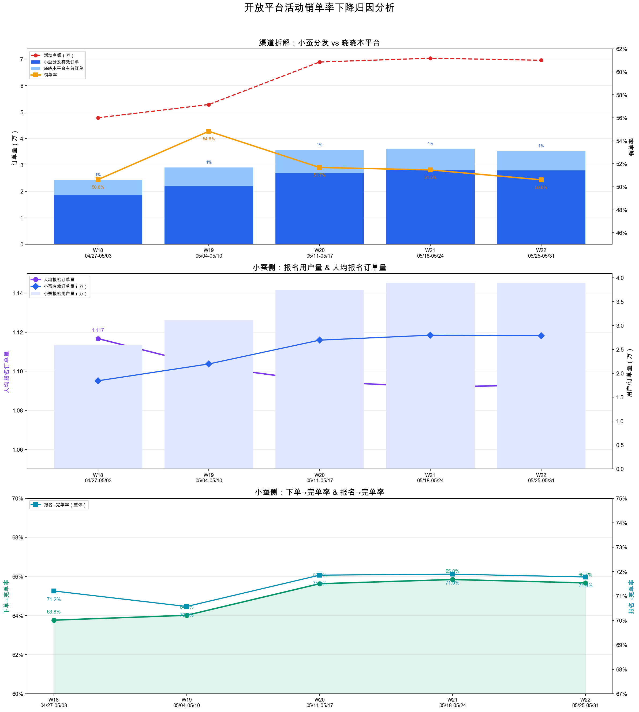

# 开放平台活动销单率下降归因分析

**日期**: 2026-05-26 | **数据范围**: 2026-05-01 ~ 2026-05-25

---

## 一句话结论

**销单率下降的直接原因是名额增速远超订单增速（+46% vs 持平），而非转化环节出问题。** 订单量未同步增长的原因：小蚕侧订单完全由 DAU 驱动（曝光→完单率恒定为~7.0%），DAU 增速从 +10.1% 放缓至 +5.7% 直接导致订单增速放缓；晓晓侧 DAU 在涨但报名转化率回落，订单不增反降。

---

## 一、业务模型与数据口径

晓晓发布活动后，同一活动在两个渠道售卖，共用活动名额：

```
晓晓发布活动 ──┬── 晓晓本平台售卖（~22%订单）
               │
               └── 分发到小蚕首页售卖（~78%订单）

销单率 = (晓晓有效订单 + 小蚕有效订单) / 活动名额
```

- **Sheet1「开放平台活动销单日趋势」**：双渠道汇总，含活动名额、总有效订单、销单率
- **Sheet2「分城市浏览报名转化」**：晓晓本平台的浏览→报名转化（全国口径）
- **Sheet3「开放平台报名转化」**：小蚕分发渠道，含 DAU（小蚕首页曝光UV）、报名→下单→完单漏斗

---

## 二、渠道拆解：销单率为什么下降

| 周 | 活动名额 | 总有效订单 | 销单率 | 小蚕订单 | 小蚕占比 | 晓晓订单 |
|---:|----:|----:|----:|----:|----:|----:|
| W18 (04/27-05/03, 仅3天) | 47,843 | 24,220 | 50.63% | 18,449 | 76.2% | 5,770 |
| W19 (05/04-05/10) | 52,833 | 28,991 | 54.83% | 21,973 | 75.9% | 7,018 |
| W20 (05/11-05/17) | 68,921 | 35,581 | 51.68% | 26,949 | 75.7% | 8,632 |
| W21 (05/18-05/24) | 70,362 | 36,168 | 51.47% | 27,988 | 77.4% | 8,179 |
| W22 (05/25, 仅1天) | 69,589 | 35,219 | 50.61% | 27,895 | 79.2% | 7,324 |

**关键发现：**

- **销单率下降是数学必然**：名额 W18→W21 增长 +46.4%（4.8万→7.0万），但订单 7 日滚动均值稳定在 3.5~3.6 万区间。分母在涨、分子不动，销单率必然被稀释。
- **小蚕分发贡献了 76%~79% 的订单**，且占比仍在上升。晓晓本平台仅占约 21%~24%。
- **晓晓本平台 W20 后收缩**：有效订单从 8,632 降至 8,179（-5.2%）。

---

## 三、小蚕侧：订单为什么没跟上名额增长？

小蚕分发是绝对主力渠道（~78% 订单），订单能否增长决定了销单率能否回升。本节回答 PM 最可能追问的问题：**"转化都没问题，为什么订单不涨？"**

### 3.1 完整漏斗

| 周 | DAU(曝光UV) | 曝光→报名率 | 报名用户 | 人均报名订单量 | 下单→完单率 | 有效订单 | 曝光→完单率 |
|---:|----:|----:|----:|----:|----:|----:|----:|
| W18 (仅3天) | 287,301 | 9.0% | 25,918 | 1.117 | 63.8% | 18,449 | 6.4% |
| W19 | 345,460 | 9.0% | 31,143 | 1.102 | 64.0% | 21,973 | 6.4% |
| W20 | 380,292 | 9.9% | 37,496 | 1.095 | 65.6% | 26,949 | 7.1% |
| W21 | 402,089 | 9.7% | 38,931 | 1.092 | 65.8% | 27,988 | 7.0% |
| W22 (仅1天) | 404,041 | 9.6% | 38,863 | 1.093 | 65.7% | 27,895 | 6.9% |

**指标说明：**
- **DAU**：小蚕首页给开放平台活动的曝光 UV
- **曝光→报名率** = 报名用户量 / DAU
- **人均报名订单量** = 报名订单量 / 报名用户量。>1 说明存在拼单或多活动参与，属正常。
- **下单→完单率** = 有效订单量 / 报名订单量
- **曝光→完单率** = 有效订单量 / DAU。从曝光到完单的整体效率。

### 3.2 核心发现：曝光→完单率恒定，订单完全由 DAU 驱动

```
有效订单 ≈ DAU × 曝光→完单率（~7.0%）
```

| 周 | DAU | DAU 环比增速 | 曝光→完单率 | 有效订单 | 订单环比增速 |
|---:|----:|----:|----:|----:|----:|
| W19 | 345,460 | — | 6.4% | 21,973 | — |
| W20 | 380,292 | **+10.1%** | 7.1% | 26,949 | **+22.6%** |
| W21 | 402,089 | **+5.7%** | 7.0% | 27,988 | **+3.9%** |

W19→W20 订单增速（+22.6%）远超 DAU 增速（+10.1%），因为曝光→报名率从 9.0% 升至 9.9%、下单→完单率从 64.0% 升至 65.6%，带来了额外增益。但这些转化率已见顶。

W20→W21 只剩下 DAU 单一驱动（+5.7%），各环节转化率均进入平台期，因此订单增速（+3.9%）自然回落。**这不是出现了新的瓶颈，而是转化效率触及稳态后的必然结果。**

**关键证据：曝光→完单率从 W20 起稳定在 7.0%，变异系数仅 1.4%。** 这意味着每 100 个曝光 UV 产出约 7 个有效订单，这个比值高度恒定。在转化效率锁死的情况下，订单增长只能靠 DAU 增长拉动。

### 3.3 各环节稳定性验证

| 环节 | W18 | W21 | 变异系数 | 判断 |
|------|-----|-----|----|------|
| 曝光→报名率 | 9.0% | 9.7% | 4.2% | → 小幅波动，近两周稳定 |
| 人均报名订单量 | 1.117 | 1.092 | 0.79% | → 极其稳定 |
| 下单→完单率 | 63.8% | 65.8% | — | ↑ 持续改善后稳定 |

所有转化环节均健康，没有恶化。

---

## 四、晓晓本平台：DAU 在涨，但报名转化率回落

| 周 | DAU | 浏览→报名率 | 报名用户 | 有效订单 | 报名→完单率 |
|---:|----:|----:|----:|----:|----:|
| W18 (仅3天) | 72,395 | 9.86% | 7,135 | 5,770 | 80.9% |
| W19 | 82,702 | 10.68% | 8,832 | 7,018 | 79.5% |
| W20 | 84,592 | 12.46% | 10,538 | 8,632 | 81.9% |
| W21 | 86,468 | 11.66% | 10,082 | 8,179 | 81.1% |
| W22 (仅1天) | 87,061 | 11.67% | 10,163 | 7,324 | 72.1% |

**关键发现：**

1. **报名→完单率稳定在 ~81%（CV=2.6%）**，后端转化没有任何问题。W20→W21 仅从 81.9% 降至 81.1%（-0.8pp），在正常波动范围内。

2. **订单下滑的根因是浏览→报名率回落**（12.46% → 11.66%）。DAU 增长 +2.2% 被报名率下降抵消，报名用户反而减少（10,538 → 10,082），订单随之下降。

3. 与小蚕侧类似，晓晓后链路转化效率已达稳态（报名→完单率 ~81%），订单量由前端（DAU × 浏览→报名率）决定。当前瓶颈在**浏览→报名**环节。

---

## 五、综合判断

### 5.1 销单率下降的两层归因

| 层次 | 归因 | 支撑数据 |
|------|------|----------|
| **第一层（数学机制）** | 名额增长 +46%，订单量持平，销单率被稀释 | 名额 W18→W21：4.8万→7.0万；订单稳定在 3.5~3.6 万 |
| **第二层（业务机制）** | 订单为什么没跟上？小蚕侧曝光→完单率恒定，订单完全由 DAU 增速决定，DAU 增速放缓导致订单增速放缓 | 曝光→完单率稳定在 7.0%；DAU 增速 +10.1%→+5.7% |

### 5.2 四个转化环节，没有一个出问题

| 环节 | W18 | 最新 | 变异系数 | 判断 |
| ---- | --- | ---- | ---- | ---- |
| 晓晓浏览→报名率 | 9.86% | 11.67% | — | ↑ 改善后回落，当前瓶颈 |
| 晓晓报名→完单率 | 80.9% | 81.1% | 2.6% | → **恒定**，后端转化健康 |
| 小蚕曝光→报名率 | 9.0% | 9.7% | 4.2% | → 窄幅波动 |
| 小蚕人均报名订单量 | 1.117 | 1.093 | 0.79% | → 极其稳定 |
| 小蚕下单→完单率 | 63.8% | 65.7% | — | ↑ 持续改善 |
| 小蚕曝光→完单率 | 6.4% | 7.0% | 1.4% | → **恒定，订单天花板** |

### 5.3 需要注意的风险信号

1. **小蚕 DAU 增速放缓**：从 +10.1%（W19→W20）降至 +5.7%（W20→W21）。如果 DAU 继续放缓，订单增速将进一步走低。
2. **晓晓本平台浏览→报名率回落**：从 12.46% 降至 11.66%，是晓晓订单下滑的直接原因。后端报名→完单率稳定在 ~81%，说明问题在流量→报名的前端环节，建议排查 W20 后是否有页面改版或流量结构变化。
3. **周末效应**：周末销单率（53.2%）高于工作日（51.9%），逐日对比时需注意，但不影响趋势判断。

### 5.4 建议

1. **销单率的提升取决于 DAU 能否继续增长**。小蚕曝光→完单率已稳定在 ~7.0%，转化效率没有优化空间，订单增量完全依赖 DAU 扩量。
2. **关注名额投放节奏**。当前名额（~7 万/天）已远超日均订单（~3.6 万），销单率持续在 50% 左右。如果销单率是关注指标，需要控制名额增速使之与 DAU 增速匹配。
3. 销单率受名额调控影响较大，建议以**有效订单量**和**曝光→完单率**作为核心双指标。

---

## 附录：结论验证

| 验证项 | 方法 | 结果 |
| ------ | ---- | ---- |
| W18/W22 数据不完整 | 检查各周天数 | W18 仅 3 天、W22 仅 1 天，报告中已标注 |
| 订单量是否真稳定 | 7 日滚动均值 | 稳定在 3.5~3.6 万区间，波动属正常范围 |
| 曝光→完单率是否恒定 | 变异系数 | CV=1.4%，极其稳定，结论可靠 |
| 人均报名订单量稳定性 | 变异系数 | CV=0.79%，极稳定 |
| 周末效应干扰 | 工作日 vs 周末分组对比 | 存在但不影响趋势判断 |

---


