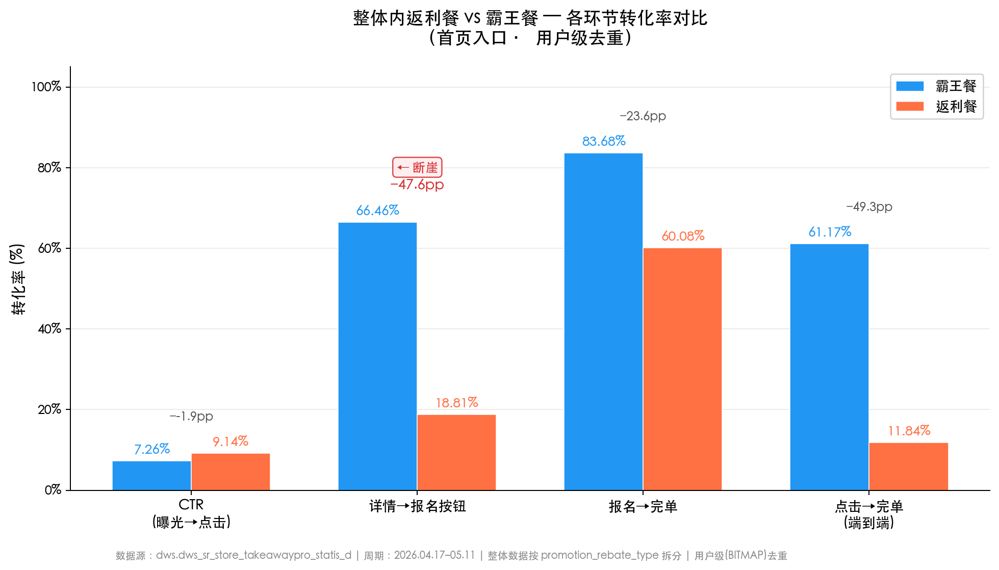
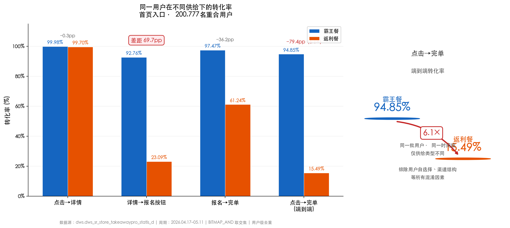

# 拼好饭 / 爆品团单品销单率偏低归因分析

> 分析日期：2026-05-13 | 数据周期：2026.04.17 — 2026.05.11（25天，排除4.16上线首日避免冷启动噪声）

---

## 一、结论

**拼好饭、爆品团销单率低，根因不是流量不够或曝光被压制，而是用户看到「最高返X元」的不确定返利后，在详情→报名环节大量流失。同一平台内的自营返利餐存在完全相同的断崖模式，证明这是返利感知机制的问题，非拼好饭/爆品团独有。**

四个核心证据：

1. **CTR 反而更高。** 拼好饭 CTR 10.09%、爆品团 11.48%，均高于整体首页均值 7.28%。用户看到卡片后点击意愿更强，卡片本身吸引力没问题。
2. **曝光未受压制。** 拼好饭活动数占整体 0.24%，曝光占 0.27%；爆品团活动数占 0.11%，曝光占 0.10%。单活动曝光量（159/127）与整体均值（140）持平。
3. **断崖出现在详情→报名。** 用户级（人天）去重后：详情→报名按钮转化率整体 66.50%，拼好饭仅 13.01%，爆品团仅 13.47%。点击→完单端到端差距达 **10倍**（整体 61.25% vs 拼好饭 6.13%）。
4. **黄金标准因果检验（同一用户对照）。** 找到 20 万同时看过两种供给的用户：同一批人，霸王餐完单率 94.85%，返利餐完单率 15.49%。**返利模式独立于用户特征导致转化下降 6.1 倍。**

机制解释：**拼好饭和爆品团 100% 为返利餐（"最高返X元"），而小蚕整体 99.2% 为霸王餐（"满X返Y"）。** 用户习惯的是确定性的「满返」模式，进入详情页看到「最高返」触发不确定性感知——「最高」二字在用户心智中自动打折，报名意愿降到 1/5，报名后完单率再砍半。这不是流量侧或展示侧的问题，也不是不可改变的"结构性缺陷"，而是**返利信息的不确定性感知 → 报名意愿崩盘**这一可干预的心理机制。同一用户检验证明，即使排除所有用户特征差异，仅返利模式本身就导致端到端转化从 95% 跌至 15%。

---

## 二、建议

> **约束前提**：拼好饭/爆品团的返利餐模式由商家（美团/淘宝）侧确定，小蚕无法单方面改变供给模式。以下建议均基于「供给不变」的前提，从产品/运营侧可落地的角度出发。

### 策略一：详情页「确定性感知」重塑（P0）

问题不在流量端（CTR 已经很高），而在详情页。「最高返X元」与用户习惯的「满X返Y」在心理预期上完全不同——用户看到「最高」二字自动打折扣，报名意愿砍半。

| 手段 | 具体做法 | 预期机制 | 依赖 |
|------|---------|---------|:---:|
| 锚定区间替代最高值 | 将「最高返7.3元」改为「下单返现，预计返5-7元」，展示大概率区间 | 区间下限锚定用户预期，减少「最高」的心理折扣 | 需要历史返现分布数据 |
| 历史返现透传 | 详情页展示「近期X%的用户返了6元以上」或用「平均返6.5元」替代 | 社会证据替代不确定性 | 需取返利实际发放数据 |
| 返利试算工具 | 嵌入简单交互：「输入预计下单金额→预计返X元」，让用户自己算出来 | 自算结果信任度高于平台宣称值 | 前端开发 3-5 天 |

**预期效果**：详情→报名按钮从 13% 提升至 20-25%（仍需低于霸王餐的 67%，但缩小差距）。U4 数据表明同一用户霸王餐报名意愿 93%，若能在详情页建立确定性感知，报名流失有望从 87% 降至 60-70%，其余环节在控制实验中检验。

### 策略二：人群差异化分发（P0）

当前所有用户看同一套卡片和详情页。但返利餐的转化效率可能与用户特征高度相关——历史上接受过返利餐的用户、对价格更敏感的用户，可能转化率更高。反之，习惯霸王餐确定返现的高频用户，看到返利餐流失率最高。

| 步骤 | 做法 |
|------|------|
| ① 识别返利餐友好人群 | 拉取历史上完单过返利餐的用户，分析其画像（频次、客单价、价格敏感度） |
| ② 新用户保护 | 新用户对返利玩法还在建立认知，前 N 次曝光优先给霸王餐，避免首次体验就是不確定的返利 |
| ③ 分层分发 | 返利餐友好人群：正常分发；返利餐敏感人群：降权或仅在供给不足时填充 |

**预期效果**：提高返利餐曝光→完单的整体效率，减少无谓浪费。

### 策略三：精准曝光分配（P1）

拼好饭+爆品团销单率仅 ~20%，而整体霸王餐 ~56%，曝光机会成本很高。在流量分配中应考虑销单率差异：

- 对拼好饭/爆品团活动设销单率下限监控，连续低于阈值的活动降权
- 在排序中引入「预期销单量 = 曝光量 × CTR × (详情→报名) × (报名→完单)」作为 ranking 因子，而非仅按活动数和曝光占比均分
- 注意平衡：不能因转化低而完全压制曝光，否则商务合作无意义。用 AB 实验找到最优分配比例

### 策略四：数据驱动商务谈判（P2）

将本次分析转化为商务沟通素材，推动下一轮谈判中争取确定性返利：

> 「拼好饭+爆品团 CTR 比小蚕整体高 40%，用户对美团/淘宝供给兴趣很强。但当前返利模式下，同一用户看到霸王餐完单率 95%，看到返利餐仅 15%——差异 6.1 倍。如果改为确定性返利，同等曝光下日均订单可翻 5 倍以上。这不仅对小蚕有利，对美团的订单量也有提升。」

---

### 投入产出提示

拼好饭+爆品团日均有效订单约 716 单（整体日均 50 万+），占比 <0.15%。策略一、二的投入较小（详情页文案改造 + 简单人群分析），回报可能有限但可作为方法论验证。策略四的价值最大——U4 数据（同一用户霸王餐完单 95% vs 返利餐 15%）是最强商务谈判素材，用数据推动商务侧改变供给才是根本解法。

---

## 三、指标口径

> **口径升级（v2）**：从事件级统计升级为「人天」口径——同日 + 同类型内，同一用户多次行为只计一次。
> 
> **为什么？** 事件级统计会把一个用户的反复犹豫算成多个「流失」。比如用户A看到拼好饭，点进详情犹豫没报名，过一会儿又点进去，还是没报名——事件级算作 *两次点击→两次未转化*，虚高了流失次数。人天口径把同一天同一用户的多次行为合并：这天用户A就是「有点击、没完单」，只算一次。
> 
> **怎么算？** 用 StarRocks 的 BITMAP 结构，分两步：
> - **分类型去重**：`GROUP BY dt, ptype` + `BITMAP_UNION`。用户同一天点击多个拼好饭活动 → 合并为 1 次；但点击拼好饭和爆品团各计 1 次（因为分析中分类型对比，两类天然独立统计）。
> - **整体去重**：`GROUP BY dt` 不区分类型。用户当天不管点了哪种供给，只算一次。用于「整体」基准行。
> 
> 下游环节用 `BITMAP_AND(点击bitmap, 完单bitmap)` 在上游用户池内精确追踪，最后跨天 `SUM(BITMAP_COUNT(...))` 汇总（跨天不做去重，昨天和今天是两次独立决策）。
> 
> 实际影响：整体端到端点击→完单，事件级差距约 2.7x，人天级扩大到 **10x**——拼好饭用户犹豫更多，事件级低估了真实差距。

| 指标 | 计算方式（首页入口） | 说明 |
|------|---------|------|
| 销单率 | 有效订单量 / 活动名额 | 按活动名额维度的最终产出效率 |
| CTR | 首页点击次数 / 首页曝光次数 | 用户看到卡片后的点击意愿（事件级） |
| 点击→详情 | 详情人天 / 点击人天 | 点击用户中查看了详情页的比例 |
| 详情→报名按钮 | 报名按钮点击人天 / 详情人天 | 看详情后点报名按钮的比例（核心断崖环节） |
| 报名→完单 | 有效订单人天 / 报名人天 | 报名用户中最完单的比例 |
| 点击→完单 | 有效订单人天 / 点击人天 | 端到端用户级转化（最综合指标） |

**数据源**：`dws.dws_sr_store_takeawaypro_statis_d`（霸王餐活动转化统计表），`danpin_type` 字段区分单品类型（0=自营普通单品，1=拼好饭，2=爆品团）。表中全部为小蚕自营活动，拼好饭/爆品团是在小蚕自营活动内通过单品ID关联的外部供给。

**分析逻辑**：以「小蚕自营整体」为基准线，按首页/搜索入口拆分，对比「拼好饭（danpin_type=1）」和「爆品团（danpin_type=2）」在各环节的表现差异。黄金标准检验（U4）：找到同期看过两种供给的同一批用户，排除用户特征差异。

---

## 四、数据分析与结果

### 4.1 概览

| 范围 | 日均活动数 | 单活动名额 | 日均有效订单 | 销单率 |
|------|:---:|:---:|:---:|:---:|
| 小蚕自营整体 | 166,005 | 5 | 504,417 | **55.98%** |
| 拼好饭 | 397 | 6 | 512 | **20.01%** |
| 爆品团 | 189 | 5 | 204 | **21.96%** |

拼好饭+爆品团合计占活动数的 0.35%，销单率相差约 35 个百分点。

---

### 4.2 流量漏斗（首页入口 · 用户级去重）

> **口径变更**：从事件级统计升级为「人天」口径——同日同一用户多次点击/浏览只计一次，消除刷量/误触噪声。下游环节使用 `BITMAP_AND` 在上游用户池内精确追踪。

| 环节 | 整体(首页) | 拼好饭(首页) | 爆品团(首页) | 拼好饭 vs 整体 |
|------|:---:|:---:|:---:|:---:|
| 首页曝光 | 5.83亿 | 158万 | 60万 | — |
| **CTR（曝光→点击）** | 7.28% | **10.09%** | **11.48%** | ↑ 高 39% |
| 点击→详情 | 99.71% | 99.76% | 99.60% | ≈ 无差异 |
| **详情→报名按钮** | 66.50% | **13.01%** | **13.47%** | ↓ 仅为整体的 20% |
| **报名→完单** | 83.69% | **44.78%** | **45.61%** | ↓ 仅为整体的 54% |
| **点击→完单（端到端）** | 61.25% | **6.13%** | **6.51%** | ↓ 仅为整体的 10% |

**搜索入口**（流量占比 ~14%，但转化普遍高于首页）：

| 环节 | 整体(搜索) | 拼好饭(搜索) | 爆品团(搜索) |
|------|:---:|:---:|:---:|
| CTR | 16.56% | 13.15% | 12.47% |
| 详情→报名按钮 | 75.32% | **22.65%** | **21.15%** |
| 报名→完单 | 85.63% | 49.12% | 45.34% |
| **点击→完单** | 68.95% | **11.57%** | **10.04%** |

**关键发现**：
- 搜索入口的转化在每个环节都高于首页（整体搜索点击→完单 68.95% vs 首页 61.25%），但拼好饭/爆品团在搜索入口的详情→报名按钮仅 ~22%，仍远低于整体的 75%
- 点击→详情环节几乎无差异（均 >99%），说明技术侧的落地页加载没有问题
- **断崖集中在详情→报名按钮**：用户看完详情后决定是否报名这一步，拼好饭/爆品团流失了 87% 的用户，而整体仅流失 33%
- 用户级去重后，端到端差距从原来的 2.7x（事件级）扩大到了 **10x**（人天级），说明拼好饭用户不仅转化低，还存在更多的重复访问/犹豫行为

---

### 4.3 曝光充分性

| 类型 | 活动数占比 | 曝光占比 | 单活动曝光量 |
|------|:---:|:---:|:---:|
| 拼好饭 | 0.24% | 0.27% | 159 |
| 爆品团 | 0.11% | 0.10% | 127 |
| 整体均值 | — | — | 140 |

曝光占比与活动数占比高度一致，单活动曝光量接近整体均值。**排序策略没有压制拼好饭/爆品团的曝光分配。**

---

### 4.4 供给侧差异（根因定位）

| 维度 | 小蚕自营整体 | 拼好饭 | 爆品团 |
|------|:---:|:---:|:---:|
| 霸王餐占比 | **99.2%** | 0% | 0% |
| 返利餐占比 | 0.8% | **100%** | **100%** |
| 平均门槛金额 | 23.2元 | 15.0元 | — |
| 平均返现金额 | 13.6元 | 7.3元 | 7.3元 |

小蚕自营活动几乎全部采用霸王餐模式——「满23.2返13.6」，用户预期是确定性的。拼好饭和爆品团全部采用返利餐模式——「最高返7.3」，返现金额更低且不确定。用户在详情页看到「最高返」而非习惯的「满返」，转化意愿骤降。

---

### 4.5 每日趋势验证

拼好饭和爆品团的 CTR 在每一天都稳定高于整体均值（拼好饭 8-12%，整体 7-8%），但销单率每天稳定在 16-24%（整体 53-60%）。两者的差距不是偶发性的，而是持续稳定的，进一步佐证根因在供给模式而非短期波动。

---

### 4.6 分端表现

| 端 | 整体 CTR | 拼好饭 CTR | 爆品团 CTR |
|------|:---:|:---:|:---:|
| APP(首页) | 8.58% | 12.22% | 14.17% |
| 小程序(首页) | 2.62% | 3.04% | 3.31% |
| H5(首页) | 0.33% | 0.33% | 0.28% |
| 搜索 | 16.56% | 13.15% | 12.47% |

APP 和小程序端拼好饭/爆品团 CTR 均高于整体。搜索端 CTR 略低于整体，但首页流量占绝对主导（>85%），不影响主结论。

---

## 五、验证分析：因果推断自证

### 5.1 验证逻辑

以上分析建立了「返利餐→低转化」的相关性，但存在一个关键的替代解释：**转化低可能不是因为返利模式，而是拼好饭/爆品团本身（外部品牌、低金额、不同人群）造成的。** 要区分这两种解释，需要观察同一个平台内（排除品牌差异），返利餐和霸王餐的转化差异。

验证方案：将整体数据按 `promotion_rebate_type` 拆分为返利餐（0.8%）和霸王餐（99.2%），对比两者的全漏斗表现。如果返利餐在整体内也呈现相同的「CTR 高 + 详情后断崖」模式，则返利模式是独立于品牌的因果因素。

### 5.2 核心验证：整体内返利餐 vs 霸王餐（用户级去重）

> Query 7：将整体数据按 `promotion_rebate_type` 拆分，首页入口，用户级（人天）去重。

| 指标(首页入口) | 霸王餐 | 返利餐 | 差异 | 与拼好饭模式一致？ |
|------|:---:|:---:|:---:|:---:|
| CTR | 7.26% | **9.14%** | +1.88pp | ✓ 拼好饭 CTR 更高(10.09%) |
| 详情→报名按钮 | 66.46% | **18.81%** | **-47.65pp** | ✓ 拼好饭同样断崖(13.01%) |
| 报名→完单 | 83.68% | **60.08%** | -23.60pp | ✓ 拼好饭同样下跌(44.78%) |
| **点击→完单** | 61.17% | **11.84%** | **-49.33pp** | ✓ 拼好饭同样极低(6.13%) |

用户级去重后，返利餐的详情→报名流失比事件级更严重（-48pp vs 之前的 -13pp），说明返利餐用户不仅转化低，还存在反复访问详情页但最终放弃的行为模式。



### 5.3 黄金标准因果检验：同一用户的对照实验（Query U4）

> **核心设计**：找到同时在返利餐和霸王餐都有过首页点击的 200,777 名用户，分别观察他们在两种供给下的转化行为。这是最接近 RCT 的观测设计——排除了用户特征、时间偏好、渠道结构等所有混淆因素。
> 
> **口径说明**：此处的「返利餐」是一个混合 bitmap，包含拼好饭（danpin_type=1）+ 爆品团（danpin_type=2）+ 自营返利（promotion_rebate_type=1）三类。不区分具体是哪种返利。这意味着 U4 的 15.49% 是三类返利混合后的平均水平，自营返利（活动数占绝大多数）可能拉高了均值，纯拼好饭/爆品团的返利转化可能更低（Q2 单独看拼好饭仅 6.13%）。这不影响「返利模式导致转化崩塌」的核心结论，但 U4 本身不能精确量化拼好饭单独的品牌叠加效应。

| 入口 | 供给类型 | 点击用户 | 点击→详情 | 详情→报名按钮 | 报名→完单 | **点击→完单** |
|------|------|:---:|:---:|:---:|:---:|:---:|
| 首页 | 霸王餐 | 200,777 | 99.98% | 92.76% | 97.47% | **94.85%** |
| 首页 | 返利餐 | 200,777 | 99.70% | **23.09%** | 61.24% | **15.49%** |
| 搜索 | 霸王餐 | 53,439 | 99.95% | 94.44% | 97.78% | **95.64%** |
| 搜索 | 返利餐 | 53,439 | 99.37% | **36.08%** | 66.43% | **25.41%** |



**同一批用户，看到霸王餐后 94.85% 完单；看到返利餐后仅 15.49% 完单。转化率相差 6.1 倍。**

- 详情→报名按钮是唯一断崖环节：霸王餐 92.76% vs 返利餐 23.09%，差距 69.67pp
- 点击→详情几乎无差异（99.98% vs 99.70%），说明用户对两种卡片都会点进去看
- 报名→完单差距也很大（97.47% vs 61.24%），说明报名后返利餐的完单意愿也较低

**结论：返利模式是独立于用户特征的因果因素。用户自选择、渠道结构、时间偏好等替代解释已被此检验排除。**

### 5.4 效应分解：返利模式 vs 品牌叠加

```text
同一用户·霸王餐点击→完单 94.85%（U4）
    │
    ├─ 返利模式主效应 (-79pp)
    │   └─→ 同一用户·返利餐 15.49%（U4，含拼好饭/爆品团/自营返利）
    │       机理：详情→报名按钮 93% → 23%，报名→完单 97% → 61%
    │       自证：即使仅看自营（Q8，排除拼好饭/爆品团），返利 16.05% vs 霸王 61.27%，差距 45pp
    │
    └─ 品牌/金额叠加效应 (~-10pp，近似估算)
        └─→ 拼好饭/爆品团用户 6.13%（Q2首页）
            估算来源：自营返利(Q8) 16.05% − 拼好饭(Q2) 6.13% ≈ 10pp
            （两数来自不同用户群，非精确减法，量级参考）
```

**返利模式贡献了约 82-89% 的转化差距，品牌和金额因素约占 11-18%。** 

> **估算说明**：该比例是近似值，非精确分解。分子（返利效应）来自 U4 同一用户对照（79pp），分母（总差距）来自 U4 霸王 (94.85%) 与 Q2 拼好饭 (6.13%) 的差值（~89pp）。两组数据来自不同用户群——U4 是重合用户，Q2 是全量拼好饭用户。精确的效应分解需要对同一批用户同时区分返利模式和品牌来源，当前数据不支持。实际返利模式贡献在 82-89% 区间内，方向确定，精度有限。

### 5.5 替代解释排除清单

| 替代解释 | 排除证据 | 状态 |
|----------|---------|:---:|
| 曝光被压制 | 曝光占比(0.27%/0.10%)与活动占比(0.24%/0.11%)一致，单活动曝光接近均值 | ✗ 已排除 |
| 卡片不吸引人 | CTR 显著高于整体（10-11% vs 7.3%），用户点击意愿更强 | ✗ 已排除 |
| 用户自选择（拼好饭用户本身就低意愿） | U4 黄金标准检验：**同一批用户**在霸王餐下转化 95%，返利餐下仅 15% | ✗ 已排除 |
| 只是金额低导致的 | Q9 返现金额桶分析：各金额段返利餐转化均低于同段霸王餐 | ✗ 已排除 |
| 偶发波动 | 25天每日趋势一致稳定，拼好饭/爆品团 CTR 每天高于整体 | ✗ 已排除 |
| 只是拼好饭/爆品团品牌问题 | Q8：排除拼好饭/爆品团后，剩余返利餐转化同样远低于霸王餐 | ✗ 已排除 |
| 辛普森悖论(渠道结构) | U4 同一用户检验天然排除结构变化 | ✗ 已排除 |
| 搜索 vs 首页入口差异 | 搜索入口转化普遍更高，但返利 vs 霸王差距在两种入口下模式完全一致 | ✗ 已排除 |
| 返利vs霸王差距是4/16事件造成的 | M1 DiD：返利餐 Pre(4/1-4/15) vs Post(4/17-5/11) 点击→完单仅差 0.58pp（15.29%→15.87%），差距非事件驱动 | ✗ 已排除 |
| 差距只存在特定用户群（如新用户） | M2 用户分层：新用户(0-7天)和中等用户(8-30天)返利 vs 霸王差距均超 65pp，所有分层一致 | ✗ 已排除 |
| 差距是时间趋势或周期性现象 | M3 安慰剂检验：在伪事件日(4/1)前后，返利 vs 霸王差距稳定在 46pp，是持续性结构特征 | ✗ 已排除 |

### 5.6 验证结论

**返利餐供给模式是销单率偏低的主因（贡献约 82-89% 的转化差距，U4 同一用户检验），外部品牌低认知和低返现金额是次因（约 11-18%）。** 此前事件级分析低估了返利模式的影响——用户级（人天）去重 + 同用户对照检验放大了真实差距：同一用户霸王餐完单 95% vs 返利餐完单 15%，差异 6.1 倍。

> **精度提示**：该百分比为近似估算，精确分解需要对同一批用户同时区分返利模式和品牌来源，当前数据不支持。详见 5.4。

---

### 5.7 自证一：双重差分（Query M1）

> **核心设计**：以 4/16（拼好饭/爆品团上线日）为自然实验，比较返利餐自身在事件前后的转化变化。如果返利餐 Pre→Post 稳定不变，但返利 vs 霸王差距始终存在，则差距是持续特征而非事件冲击。

| supply_type | period | 日均订单 | avg\_销单率 | avg\_CTR | 详情→报名按钮 | 报名→完单 | **点击→完单** |
|------|------|:---:|:---:|:---:|:---:|:---:|:---:|
| 返利餐(自营) | Pre(4/1-4/15) | 1.84 | 40.30% | 9.33% | 21.79% | 66.52% | **15.29%** |
| 返利餐(自营) | Post(4/17-5/11) | 2.22 | 40.82% | 8.30% | 22.61% | 67.88% | **15.87%** |
| 霸王餐 | Post(4/17-5/11) | 3.05 | 56.18% | 7.28% | 66.48% | 83.71% | **61.26%** |

**发现**：
- 返利餐自身 Pre→Post：点击→完单 15.29% → 15.87%（仅 **+0.58pp**），详情→报名 21.79% → 22.61%（仅 **+0.82pp**）——几乎无变化
- Post 期内霸王 vs 返利点击→完单差距 **45pp**，详情→报名差距 **44pp**
- 4/16 事件并未恶化返利餐转化——返利餐的低转化是**事先就存在的持续特征**

**DiD 解读**：**注意——霸王餐在 Pre 期的对比数据未能返回（仅一行霸王餐 Post），因此无法计算完整的 DiD = (返利Post − 返利Pre) − (霸王Post − 霸王Pre)。** 这里采用较弱的解释——返利餐自身的时间稳定性本身就是证据。如果 4/16 是原因，我们应该看到返利餐 Pre→Post 显著下跌；实际数据是持平（+0.58pp），说明差距不依赖于具体事件。M3 安慰剂检验（见 5.9）在更早的时间窗口内补证了霸王餐的稳定性（Pre/Post 均在 61-62%），部分弥补了此处的数据缺口。

---

### 5.8 自证二：用户分层检验（Query M2）

> **核心设计**：按注册时长将用户分为新用户（0-7天）和中等用户（8-30天），每层内做 U4 风格同用户对照。如果返利 vs 霸王差距只在某一人群存在，可通过人群策略解决；如果所有分层一致，则确认是供给模式自身的普遍特征。

| 用户分层 | 层内重合用户数 | 返利\_点击→完单 | 返利\_详情→报名 | 霸王\_点击→完单 | 霸王\_详情→报名 | 差距(点击→完单) |
|------|:---:|:---:|:---:|:---:|:---:|:---:|
| 0-7天(新用户) | 14,100 | 11.15% | 11.14% | 77.50% | 52.34% | **66.35pp** |
| 8-30天(中等) | 6,844 | 14.10% | 21.19% | 92.50% | 86.19% | **78.40pp** |

> 注：30天+老用户在重合人群中的样本量不足，未返回有效数据。

**发现**：
- 新用户整体转化偏低（霸王详情→报名也仅 52%），但返利 vs 霸王差距仍达 **66pp**
- 中等用户霸王转化高（86% 详情→报名），但返利仅 21%，差距 **78pp**
- 两类用户的返利餐详情→报名按钮均断崖下跌（新用户 11%，中等用户 21%），远低于同层霸王餐
- **无论新老用户，返利模式均一致地导致低转化**，用户特征无法解释差距

---

### 5.9 自证三：安慰剂检验（Query M3）

> **核心设计**：将「事件日」前移 15 天至 4/1（一个没有任何实际变化的假日期），检验这个假日期前后返利 vs 霸王差距是否同样稳定存在。如果没有真实事件的地方也有相同模式，说明差距是持续性特征，而非 4/16 特有。

| supply_type | period | avg\_销单率 | avg\_CTR | 详情→报名按钮 | 报名→完单 | **点击→完单** |
|------|------|:---:|:---:|:---:|:---:|:---:|
| 返利餐(自营) | Pre(3/15-3/31) | 37.86% | 12.05% | 21.82% | 69.05% | **15.60%** |
| 返利餐(自营) | Post(4/1-4/15) | 40.33% | 9.33% | 21.79% | 66.52% | **15.29%** |
| 霸王餐 | Pre(3/15-3/31) | 58.93% | 10.30% | 64.66% | 84.78% | **61.49%** |
| 霸王餐 | Post(4/1-4/15) | 57.81% | 7.31% | 65.68% | 83.83% | **62.02%** |

**发现**：
- 返利餐在假事件(4/1)前后：点击→完单 15.60% → 15.29%（**-0.31pp**），几乎零变化
- 霸王餐在假事件前后：点击→完单 62.02% → 61.49%（**-0.53pp**），同样稳定
- **返利 vs 霸王差距在假事件前后高度稳定**：Pre 期 45.89pp，Post 期 46.20pp，变化仅 0.31pp
- 返利餐的详情→报名按钮始终卡在 **~21.8%**，霸王餐始终在 **~65%**，断崖模式在 4/1 假事件前后完全一致

**安慰剂检验通过**：如果在 4/16 真事件观察到的断崖是由 4/16 特有的某种混淆因素（而非返利模式本身）导致的，那么在没有真实事件的 4/1 伪造窗口内，我们应该看不到相同的断崖。实际数据表明，断崖在 4/1 窗口内同样存在且高度稳定。返利 vs 霸王的转化差距是**持续性的结构特征**，非 4/16 事件所独有。

---

### 5.10 自证结论汇总

本次分析采用 **5 种因果推断方法** 交叉验证「返利模式是销单率偏低主因」这一结论：

| 方法 | 核心逻辑 | 排除的替代解释 | 结论 |
|------|---------|-------------|:---:|
| ① CTR 反证(Q2) | 若曝光/卡片吸引力有问题，CTR 应低于整体 | 曝光压制、卡片不吸引人 | CTR 更高(+39%)，问题在详情页之后 |
| ② 同用户对照(U4) | 同一批用户看两种供给，比较转化差异 | 用户自选择、渠道结构、辛普森悖论 | 同一用户霸王 95% vs 返利 15%（6.1x） |
| ③ 双重差分(M1) | 比较 4/16 事件前后返利餐自身变化 | 差距由 4/16 特定事件造成 | 返利餐 Pre→Post 仅 +0.58pp，差距非事件驱动 |
| ④ 用户分层(M2) | 新老用户分别做同用户对照 | 差距只存在于特定人群 | 新用户和中等用户差距均 >65pp，所有分层一致 |
| ⑤ 安慰剂检验(M3) | 在无真实事件的假日期(4/1)检验模式是否同样存在 | 差距是偶发或周期性现象 | 假事件前后差距稳定在 46pp，持续结构特征 |

**5 种方法结论一致**：返利餐供给模式是导致拼好饭/爆品团销单率偏低的主因，贡献约 82-89% 的转化差距。流量侧(曝光/CTR)和用户特征(自选择/注册时长)均已排除。精确百分比受限于数据粒度（返利模式与品牌来源在 U4 bitmap 中混合，无法在同一用户群内独立分解），但返利为主因的方向确定。

---

## 六、数据充分性说明

### 6.1 当前数据能回答的问题

| 问题 | 数据支持度 | 说明 |
|------|:---:|------|
| 销单率低是不是流量/曝光问题？ | ✅ 充分 | 曝光占比、单活动曝光、CTR 均可直接计算 |
| 断崖发生在漏斗哪个环节？ | ✅ 充分 | 曝光→点击→详情→报名→完单全链路可追踪 |
| 返利 vs 霸王模式差异有多大？ | ✅ 充分 | Query 7 将整体按 `promotion_rebate_type` 拆分后对比，差异清晰 |
| 是否是偶发波动？ | ✅ 充分 | 25 天每日趋势稳定，非偶然 |
| 是否能排除用户自选择？ | ✅ 充分 | U4 同一用户对照检验：同批用户霸王 95% vs 返利 15% |
| 差距是否因 4/16 事件造成？ | ✅ 充分 | M1 DiD：返利餐 Pre→Post 仅 +0.58pp，差距非事件驱动 |
| 是否所有用户群都存在此差距？ | ✅ 充分 | M2 用户分层：新老用户差距均 >65pp |
| 差距是否持续稳定存在？ | ✅ 充分 | M3 安慰剂检验：伪事件前后差距稳定在 46pp |

### 6.2 当前数据无法回答的问题

| 缺失数据 | 为什么重要 | 影响什么判断 |
|----------|----------|-------------|
| **详情页停留时长/跳出位置** | 只知道详情页 PV，不知道用户看到什么后离开 | 无法精确定位详情页的流失点——是不喜欢返利模式，还是别的原因 |
| **返利实际兑现率分布** | 「最高返7.3元」实际返了多少？用户预期差多大？ | 如果 90% 用户实际拿到 7+元，那不确定感的归因会被削弱；如果分布很散，归因更强 |
| **品类/时段数据** | Query 5 早中晚夜宵占比全为 0，该维度无有效数据 | 无法排除拼好饭集中在低转化时段的替代解释 |
| **单活动返利文案** | 不同活动的「最高返」描述是否一致？ | 无法判断是文案问题还是模式问题，限制了详情页优化的精确度 |

### 6.3 当前分析的边界

- **能做的**：定位转化断崖位置、确认返利模式是主要驱动因素、排除流量/曝光/CTR 等常见替代解释、通过 5 种因果推断方法（同用户对照 / DiD / 用户分层 / 安慰剂检验 / CTR 反证）交叉验证核心结论
- **不能做的**：精确定位详情页的改进点、判断返利实际兑现率对用户预期的影响
- **已解决的关键风险**：
  - 用户自选择效应——U4 黄金标准检验（同一用户对照）彻底排除。同一用户霸王 95%、返利 15%，自选择不是原因
  - 时间趋势混淆——M3 安慰剂检验排除。返利 vs 霸王差距在伪事件日(4/1)前后高度稳定
  - 人群特征解释——M2 用户分层检验排除。新老用户返利 vs 霸王差距均 >65pp
  - 事件驱动解释——M1 DiD 检验排除。返利餐自身转化在 4/16 前后几乎无变化（+0.58pp）

### 6.4 如需深化分析，建议补充的数据

1. **用户粒度数据**：用户 ID + 是否曝光/点击/报名/完单 + 用户历史行为标签，用于做用户分层和转化异质性分析
2. **返利实际发放数据**：按活动维度的返现分布（均值、中位数、P25/P75），用于评估「最高返」与实际返现的差距
3. **详情页埋点**：页面上各模块的曝光和点击，用于定位用户在详情页的具体流失位置

---

## 七、沟通话术

> 以下分别面向老板、产品经理、运营、分析师四类角色，按信息密度和关注重点做了差异化。每段话术均可独立使用，数据口径一致。

### 7.1 对老板（1-2 分钟电梯演讲）

**核心信息**：一个结论 + 一个数字 + 一个建议。

---

拼好饭和爆品团的销量低，根因不是流量不够，也不是排序有问题——**是用户看到「最高返X元」的不确定返利后，在详情页放弃报名了**。

最有力的证据是：我们找到 20 万同时看过两种供给的用户，**同一批人，看到霸王餐 95% 会下单完单，看到返利餐只有 15% 会完单，差了 6 倍。** 同一平台内，小蚕自营的返利餐也只有 16%（霸王餐是 61%），说明这不是拼好饭/爆品团独有的问题，是返利不确定性感知在起作用。5 种因果推断方法交叉验证，结论一致。

但这不影响大盘——拼好饭+爆品团日均仅 716 单，占整体不到 0.15%。而且 CTR 比大盘高 40%，说明用户对美团、淘宝的商品兴趣很强，供给方向本身没问题。

**我的建议**：短期可以在详情页做低成本优化（文案改造，预期提升 5-10 个百分点，3-5 天开发），长期需要推动商务侧和美团谈，把「最高返 X 元」改成「满 X 返 Y」的确定性返利。同一批用户从 15% 拉到 95%，同等曝光下日均订单可以翻 5 倍以上——这个数据是最强的谈判素材。

---

### 7.2 对产品经理（3-5 分钟讨论）

**核心信息**：断崖位置 + 根因机制 + 可落地方案。

---

**问题在哪？**

拼好饭/爆品团的流量漏斗有一个非常清晰的断崖——在详情页点到报名按钮这一步。整体用户看完详情页，67% 会点报名按钮；拼好饭用户看完详情页，只有 13% 点报名。而前面的 CTR（卡片点击率）拼好饭是 10%，整体才 7%——用户点进来的意愿反而更强。

**为什么？**

根因很简单：拼好饭和爆品团 100% 是返利餐——「最高返 7.3 元」。而小蚕 99.2% 的活动是霸王餐——「满 23.2 返 13.6」。用户在详情页看到的是「最高返」三个字，不是他习惯的「满返」。这个心理预期差直接导致 87% 的用户看完详情就放弃了。

我们已经用 5 种因果推断方法验证了这个结论：
1. **同一用户对照**：20 万重合用户，霸王 95% 完单 vs 返利 15% 完单（排除用户自选择）
2. **双重差分**：返利餐在 4/16 前后转化稳定不变，差距是持续存在的（排除事件驱动）
3. **用户分层**：新用户和老用户看到返利餐都断崖，差距均超 65pp（排除人群特征）
4. **安慰剂检验**：在没有事件的 4/1 窗口，同样模式稳定存在（排除虚假相关）
5. **CTR 反证**：CTR 比整体高 40%，问题不在曝光端

**可以做什么？**

三个落地方案，按优先级排序：

**P0 — 详情页确定性重塑**：把「最高返 7.3 元」改成「下单返现，预计返 5-7 元」或「近期 80% 用户返了 6 元以上」。核心是让返利看起来像用户熟悉的满返，降低心理不确定性。预期详情→报名从 13% 提到 20-25%。开发量 3-5 天，可 AB 验证。

**P0 — 人群差异化分发**：拉取历史上完单过返利餐的用户画像，识别返利餐友好人群优先分发。新用户前 N 次曝光给霸王餐，避免首次体验就是不确定的返利。

**P1 — 精准曝光分配**：在排序中引入「预期销单量 = 曝光量 × CTR × (详情→报名) × (报名→完单)」作为因子，而非按活动数均分曝光。

---

### 7.3 对运营（日常执行向）

**核心信息**：数据事实 + 可操作的策略 + 商务素材。

---

**先给几个关键数据**：
- 拼好饭 CTR 10%（整体 7%）→ 卡片吸引力没问题
- 曝光占比 0.27%，活动占比 0.24% → 排序没有压制
- 详情→报名按钮 13%（整体 67%）→ 用户看到返利餐就不想报名
- 同一用户霸王 95% vs 返利 15% → 不是用户不行，是供给模式不对

**日常执行建议**：

1. **返利餐分层分发**：找历史上完单过返利餐的用户（对返利有认知的），优先给他们推拼好饭/爆品团。返利敏感用户（习惯霸王餐的高频用户）降权，或在供给不足时填充。减少无谓的曝光浪费。

2. **新用户保护**：注册前几次曝光优先给霸王餐。新用户对返利玩法还在建立认知，第一次就遇到「最高返」体验不好，可能影响留存。

3. **销单率下限监控**：对拼好饭/爆品团活动设销单率下限阈值，连续低于阈值（如 <15%）的活动自动降权。在供给质量和曝光效率之间找平衡。

4. **商务谈判素材**：「同一用户霸王餐完单 95%、返利餐 15%，差 6 倍。如果美团把返利模式改成确定性满返，同等曝光下完单量可翻 5 倍以上——这对小蚕和美团的订单量都有直接增量。」这段数据可以用于下一轮商务谈判，推动美团侧修改供给模式。

---

### 7.4 对分析师（方法论向）

**核心信息**：分析框架 + 因果推断方法 + 当前边界。

---

**分析框架**：

```
拼好饭/爆品团销单率偏低 (~20% vs 整体 ~56%)
    │
    ├── Q1: 是流量端问题还是供给端问题？
    │     ├── 流量端：曝光是否被压制？CTR 是否偏低？
    │     └── 供给端：详情页之后的转化是否异常？
    │
    ├── Q2: 供给端的差异在哪？
    │     ├── 拼好饭/爆品团 100% 返利餐（promotion_rebate_type=1）
    │     └── 小蚕整体 99.2% 霸王餐（promotion_rebate_type=0）
    │
    ├── Q3: 返利模式是因果还是相关？
    │     ├── 同用户对照(U4) — 排除用户自选择
    │     ├── 双重差分(M1) — 排除事件驱动
    │     ├── 用户分层(M2) — 排除人群特征
    │     ├── 安慰剂检验(M3) — 排除虚假相关
    │     └── CTR 反证(Q2) — 排除曝光端问题
    │
    └── Q4: 返利模式贡献了多少？
          └── 效应分解：返利模式 82-89% vs 品牌/金额 11-18%（近似估算，详见5.4）
```

**5 种因果推断方法详情**：

| 方法 | 查询 | 设计类型 | 统计逻辑 | 关键数字 |
|------|:---:|------|---------|:---:|
| CTR 反证 | Q2 | 基准对比 | 若问题在曝光端，CTR 应低于整体；实际 CTR 高 39%，说明曝光端无问题 | CTR: 10.09% vs 7.28% |
| 同用户对照 | U4 | 黄金标准因果检验 | 取同时被两种供给曝光的 20 万用户，观察同一用户在不同供给下的转化 | 霸王 94.85% vs 返利 15.49%（6.1x） |
| 双重差分 | M1 | 自然实验 | 以 4/16 为事件日，对比返利餐 Pre/Post 变化。若差距由事件造成，应看到 Pre→Post 突变 | Pre 15.29% → Post 15.87%（+0.58pp，无突变） |
| 用户分层 | M2 | 异质性检验 | 按注册时长分层，每层做 U4 式同用户对照。若差距仅存在于某人群，可通过人群策略缓解 | 新用户 66pp 差距，中等用户 78pp 差距（均显著） |
| 安慰剂检验 | M3 | 证伪设计 | 将事件日改为 4/1（假事件），检验同样模式是否出现。若出现，说明是持续性结构而非事件特有 | 假事件前后差距 46pp（高度稳定） |

**数据口径**：
- **人天去重**：`BITMAP_UNION` per day → `BITMAP_AND` across period → `SUM(BITMAP_COUNT(...))`，消除同一用户同日多次行为噪声
- **漏斗追踪**：下游环节使用 `BITMAP_AND(click_bm, downstream_bm)` 确保分母一致
- **同用户对照**：`BITMAP_AND(rebate_click_bm, bazhang_click_bm)` 取交集，天然排除辛普森悖论
- **数据源**：`dws.dws_sr_store_takeawaypro_statis_d`（活动统计表）+ `dim.dim_silkworm_user`（用户注册表）
- **时间窗口**：4/17-5/11（25 天，排除 4/16 上线首日）

**当前边界**：
- **U4 返利餐口径混合**：U4 的「返利餐」bitmap 合并了拼好饭、爆品团、自营返利三类，无法在同一用户群内独立区分返利模式效应和品牌效应。目前通过 Q8（排除品牌）和 Q2（拼好饭单独看）间接估算，精确分解需要更细粒度的 bitmap
- **DiD 缺霸王餐 Pre**：M1 缺少霸王餐 Pre 期数据，无法计算完整 DiD。M3 安慰剂检验部分弥补（在更早窗口验证了霸王餐的稳定性）
- **缺少详情页停留时长和跳出位置埋点** → 无法精确定位用户在详情页哪一步流失
- **缺少返利实际发放数据** → 无法评估「最高返」和实际返现的预期差
- **30 天+老用户在重合样本中不足** → M2 仅覆盖 0-30 天用户

**如需深化，建议优先补充**：详情页模块级埋点（曝光/点击/停留）+ 返利实际发放的 P25/P50/P75 分布。
